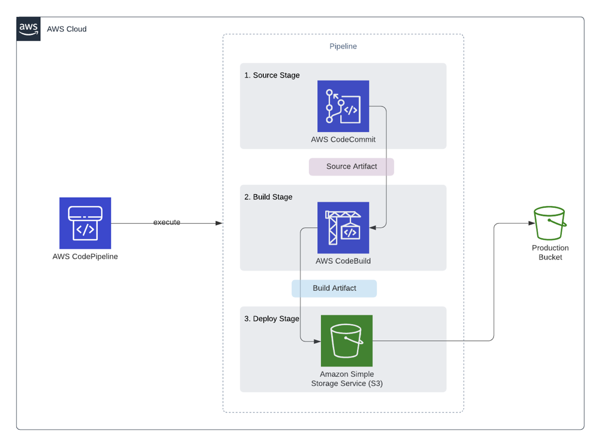

Hey folks!

Today we will have a look to how we can configure a pipeline to automate our deployment for our Angular web application.

I think most of developers that works in a team, don't want to deals with deployments. It's redundant, not fun and lack of time.

> Some funny story that I faced in my experience: I remember when I started my first job, our deployment strategy was really, really a nightmare. We used a "FTP" server, to manually deploy the source code in a folder every times we wanted to deploy a new version of the app. The first step was to copy the actual remote folder from the FTP to local (to rollback if something wrong happen with the new version), upload the new one and wait until the content is fully upload. And of course, you have to deals with disconnection, latency etc. :D

But before going further what is CI/CD ?

**Continuous Integration (CI)** is a development practice that requires developers to integrate code into a shared repository several times a day. Each check-in is then verified by an automated build, allowing teams to detect problems early.

**Continuous Delivery (CD)** is the natural extension of Continuous Integration: an approach in which teams ensure that every change to the system is releasable, and that we can release any version at the push of a button. Continuous Delivery aims to make releases boring, so we can deliver frequently and get fast feedback on what users care about.

(source: [codefresh.io](https://codefresh.io/continuous-integration/continuous-integration-delivery-pipeline-important/?utm_source=google&utm_medium=cpc&utm_campaign=docker-ci-cd&utm_term=ci%20cd%20tools&hsa_acc=5584137208&hsa_cam=1603277939&hsa_grp=59754208254&hsa_ad=317015661094&hsa_src=g&hsa_tgt=kwd-492577851032&hsa_kw=ci%20cd%20tools&hsa_mt=b&hsa_net=adwords&hsa_ver=3&gclid=Cj0KCQiA9P__BRC0ARIsAEZ6irh7T4Wb3-4ouTLcdC5jiQRgJIqc_50CP-z5gXtuXzaxJJ2HtgLUZY0aAnb_EALw_wcB))

And finally, this is what we will achieve in this tutorial (our pipeline) :



Like the others article, if you want to do this tutorial, there is a list of pre-requisites that you must have before continuing:

- An AWS account is required ([click here](https://portal.aws.amazon.com/billing/signup#/start) to create one)
- Angular ([click here](https://angular.io/guide/setup-local) to install)
- Git ([click here](https://git-scm.com/downloads) to install)
- A [Github](https://github.com) account.

Ok, now you are able to start, let's move on!

---

#Step 1: Creation of our S3 Bucket

#Step X: Creation of our Angular app.

The goal here, is not to provide a complex app, we will just use the default app generated via the ng cli. Let's navigate to your projects folder, and hit :
```
ng new angular-aws-ci-cd
```


