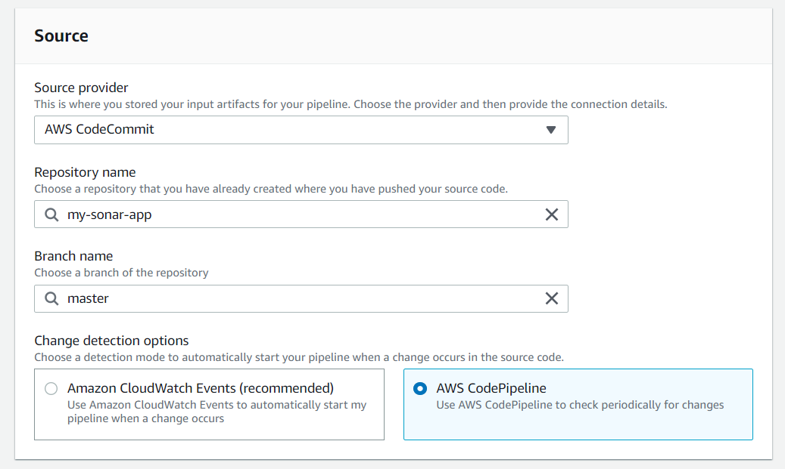

Hello there, today we will look forward to how you can deploy a **Sonarqube** in the AWS Cloud, using Amazon Cloud Compute (EC2) Service.

Before going further, let's introduce what is Sonarcube :

SonarQube is the leading tool for continuously inspecting the Code Quality and Security of your codebases
and guiding development teams during Code Reviews.

It helps your development team to write cleaner and safer code. It provides also a **continuous code inspection** thanks to multiple automated static code analysis rules, protecting your app on multiple fronts, and guiding your team.

SonarQube main components are :
- **Code Reliability**: Catch tricky bugs to prevent undefined behaviour from impacting end-users.
- **Application Security**: Fix vulnerabilities that compromise your app, and learn AppSec along the way with Security Hotspots.
- **Technical Debt**: Make sure your codebase is clean and maintainable, to increase developer velocity!

Actually, 27 programming languages can be handled with Sonarqube :
- Java / C# / C / C++ / JavaScript / TypeScript / Python / Go & 19 more!

I think I summarize a little bit what is Sonar, you can click here if you want more information about the product.

Let's start! In this tutorial, we will need :
- An AWS Account (to create one, please visit [this link](https://portal.aws.amazon.com/billing/signup#/start)).
- Node Package Manager ([npm](https://www.npmjs.com/get-npm)) or other package managers like [yarn](https://classic.yarnpkg.com/en/docs/install/#windows-stable).
- A terminal (with Admin Rights).
- Angular CLI (Available [here](https://angular.io/cli) or if you have a package manager, just run `npm install -g @angular/cli` or `yarn install -g @angular/cli`).


###Step 1: Create the EC2 Instance

Before going further, I suggest you create an IAM Admin user in your AWS account which will have the AdministratorAccess IAM Policy. For the rest of the tutorial, I will use the AWS Region: **London (eu-west-2)**.

Let's connect through the AWS Console, and navigate to the EC2 Service (under the Compute layer).

Launch a new instance, and select the first AMI `Amazon Linux 2 AMI (HVM), SSD Volume Type`.

Sonarqube required at least **3GB RAM**, so I recommend to use a **t2.medium** or higher as Instance Type. Be careful, this kind of instance type are not free tier eligible, and you will be charged for this utilization (depend on your usage).

Leave the default configuration as is, and click on **Review and Launch**.

Before launching the EC2 Instance, if you already have a key pair, select it. If not, create a new one. This key pair will be used to connect to your EC2 Instance through ssh.


Once you downloaded your select or created your EC2 Key Pair, you can launch your instance.

Wait a few seconds, and your instance will be available. To connect to your EC2 Instance, go back to the EC2 Dashboard, and click on the Running Instance or click on View instance just after it has been created.

Open a terminal, and locate the place you downloaded your EC2 Key Pair (It's a .pem file) :

```batch
chmod 400 << your key pair pem file >>.pem
ssh -i "<< your key pair pem file >>" ec2-user@<< ec2 instance public DNS address >>
```

Once connected to your EC2, you should see something like this :
```
       __|  __|_  )
       _|  (     /   Amazon Linux 2 AMI
      ___|\___|___|

https://aws.amazon.com/amazon-linux-2/
13 package(s) needed for security, out of 22 available
Run "sudo yum update" to apply all updates.
[ec2-user@ip-<< your ec2 ip >> ~]$
```

First, run a **sudo yum update** to apply all updates.

Then, we will install and configure a PostgreSQL Database. This database is needed to save the SonarQube analysis :
```
# Add the pgdg repository in Amazon Linux
sudo amazon-linux-extras install postgresql10

# Now, install postgresql 10
sudo yum install -y postgresql-server postgresql-devel

# Create a new PostgreSQL database cluster
sudo /usr/bin/postgresql-setup --initdb

# Start the PostgreSQL service
systemctl start postgresql
```

Normally you will see your PostgreSQL running if you type `systemctl status postgresql` :


The next step is to create our database user and our database. For that, we will use the **PSQL Shell**.

```
sudo -u postgres psql postgres
```

And run these queries :
```
postgres=# CREATE USER sonar WITH ENCRYPTED PASSWORD '<< put a password >>'
postgres-# ;
postgres=# CREATE DATABASE sonarqube;
postgres=# GRANT ALL PRIVILEGES ON DATABASE sonarqube to sonar;
postgres=#
```

Ok, now our DB, DB User and our User Privileges are created. The latest step for psql shell is to locate the `pg_hba.conf` configuration file :
```
SHOW hba_file;

# you should have an output like this :
postgres=# SHOW hba_file;
            hba_file
---------------------------------
 /var/lib/pgsql/data/pg_hba.conf
(1 row)
```

For me its actually located in `/var/lib/pgsql/data/pg_hba.conf`, but maybe it can be different for you.

Once you have the file path, quit the psql shell with `\q`.

We will edit the file with nano :
```
sudo nano /var/lib/pgsql/data/pg_hba.conf
```

and replace all the content by :

```
local   all     sonar   md5
local   all     all     peer
host    all     all     127.0.0.1/32    md5
host    all     all     ::1/128         md5
```

Then restart the PostgreSQL service  (with sudo):
```
sudo systemctl restart postgresql
```

Next step is to create a non-root Sonar System User :
```
# creating user group :
sudo groupadd sonar

# creating user named sonar without sign in options
sudo useradd -c “SonarDemoJstw” -d /opt/sonarqube -g sonar -s /bin/bash sonar

# set a password to activate our user :
sudo passwd sonar

# add the user to the sudo groups
sudo usermod -a -G sonar ec2-user
```

Let's continue and install OpenJDK 11. Java is required for Sonarqube, and we will use version 7.9+ of Sonar that need Java 11.

```
# downloading zip file
curl -O https://download.java.net/java/GA/jdk11/13/GPL/openjdk-11.0.1_linux-x64_bin.tar.gz

# unzip and move files to the correct place
tar zxvf openjdk-11.0.1_linux-x64_bin.tar.gz
sudo mv jdk-11.0.1 /usr/local/

# change access from the jdk folder
sudo chmod -R 755 /usr/local/jdk-11.0.1
```

We need to add java to the $PATH. For that, use `sudo nano /etc/profile` and add these following lines at the end of the file :

```
export JAVA_HOME=/usr/local/jdk-11.0.1
export PATH=$JAVA_HOME/bin:$PATH
```

Do not forget to `source /etc/profile` to load configuration changes.

Finally, you should have Java installed, and you can check yourself by writing `java -version`, you should see :

```
$ java -version
openjdk version "11.0.1" 2018-10-16
OpenJDK Runtime Environment 18.9 (build 11.0.1+13)
OpenJDK 64-Bit Server VM 18.9 (build 11.0.1+13, mixed mode)
```

Here we are! We can now install Sonarqube ;-)

```
# download Sonarqube
wget https://binaries.sonarsource.com/Distribution/sonarqube/sonarqube-7.9.1.zip

# unzip files
unzip sonarqube-developer-7.9.1.zip

# move sources to the approriate folder
sudo mv -v sonarqube-7.9.1/* /opt/sonarqube

# change ownership of all the sonarqube files to user sonar
sudo chown -R sonar:sonar /opt/sonarqube

# change file access privileges
sudo chmod -R 775 /opt/sonarqube
```

Before running Sonarqube, we will have some few updates to do in the configuration files.

Edit the `sonar.sh` file :

```
sudo nano /opt/sonarqube/bin/linux-x86-64/sonar.sh
```

Find the commented line `#RUN_AS_USER=` and replace by :
```
RUN_AS_USER=sonar
```

Quit and save this file, and open the `sonar.properties` file :

```
sudo nano /opt/sonarqube/conf/sonar.properties
```

First step, is to use the JDBC credentials. Find the commented lines `sonar.jdbc.username` and `sonar.jdbc.password` and replace by :
```
sonar.jdbc.username=sonar
sonar.jdbc.password=<< your DB password >>
```

> The DB password was the one created by the `CREATE USER sonar WITH ENCRYPTED PASSWORD '<< put a password >>' request.

Do not quit the file edition, and this time uncomment the `sonar.jdbc.url` line and replace by :
```
sonar.jdbc.url=jdbc:postgresql://localhost/sonarqube
```

Let's check also the **WEB SERVER** configuration, find the `sonar.web.javaOpts` line, uncomment it and put :

```
sonar.web.javaOpts=-Djava.net.preferIPv4Stack=true
```
> Sometime, Java trying to use IPv6. So we will force Java to prefer IPv4 instead.

Just below, you will have also a `sonar.web.javaAdditionalOpts` commented line. Uncomment it, and add :

```
sonar.web.javaAdditionalOpts=-server
```

Find the `sonar.web.host`, and uncomment it. You can keep the default value `0.0.0.0`.

Finally, you can save your changes and exit this file.

Before starting the Sonar server, we will override some defaults limit configuration :

Edit both `/etc/systemd/user.conf` and `/etc/systemd/system.conf`, then add this following line at the end:
```
DefaultLimitNOFILE=65536
```

Once is done, edit `/etc/security/limits.conf` and add these following lines :
```
*  soft    nofile  65536
*  hard    nofile  65536
elasticsearch   soft    nofile  65536
elasticsearch   hard    nofile  65536
elasticsearch   memlock unlimited
```


Edit the `/etc/sysctl.conf` file and add this following line :
```
vm.max_map_count=262144
```

Reload the system configuration with `sudo sysctl -p` and `sudo systemctl restart postgresql`.

Disconnect from the server, and reconnect again :

```
# disconnect
exit

# reconnect
ssh -i "<< your key pair pem file >>" ec2-user@<< ec2 instance public DNS address >>
````

I think it's time to start the Sonar server :
```
/opt/sonarqube/bin/linux-x86-64/sonar.sh start
```

> Provide the password we defined for the sonar sudo user.

Here we are, your Sonarqube server should run ;-)

Before accessing it, you need to add a security rule to allow inbound traffic to Sonarqube.

Go to the `EC2 Services > Running instances`. Find your instance, and click on the Security Group associated :


You will be redirected to your Security Group. Click on the **Inbound Rules** tab, and edit them.

Add a new rule like below :


> By default, Sonarqube is running on port 9000. You can change this default port by editing the **sonar.properties** file in **/opt/sonarqube/conf** folder.

> Do not forget to restart sonar just after.

Save your rules, and to access to your Sonarqube server, find your EC2 IPv4 Public address in the EC2 Running Instances dashboard, open a new tab with this following URL :
`http://<< your ec2 public IP address >>:9000`

And finally, you should see the Sonar interface :


Let's create a sample test project. You can create any kind of project you want, but for this example, I will go for an Angular project.

```
ng new my-sonar-app
```

To integrate our Angular app in Sonar, we need a specific package: `sonar-scanner`. Install this package like below :
```
npm install -g sonar-scanner
```

The next step is to write some configuration to tell our Angular App how to communicate with our Sonarqube server. For that, create a file named `sonar-project.properties` and add this content :
```
sonar.host.url=http://<< your ec2 public ipv4 >>:9000
sonar.login=admin
sonar.password=admin
sonar.projectKey=my-sonar-app
sonar.projectName=my-sonar-app
sonar.projectVersion=1.0
sonar.sourceEncoding=UTF-8
sonar.sources=src
sonar.exclusions=**/node_modules/**
sonar.tests=src
sonar.test.inclusions=**/*.spec.ts
sonar.typescript.lcov.reportPaths=coverage/lcov.info
```

Then, add a script to run our sonar scanner in the `package.json` file :

```
"scripts": {
    // ... other scripts ...
    "sonar": "sonar-scanner"
}
```

> If you don't want to install sonar-scanner as a global dependency you can also install it as a devDepencies in your app. But you need to adapt the npm run script.

Before running

Open a terminal as Administrator, and then go to your project directory. Let's run the sonar script: `npm run sonar`.

A few moments later, you should have an output like this :

```
INFO: Analysis report generated in 86ms, dir size=176 KB
INFO: Analysis report compressed in 56ms, zip size=44 KB
INFO: Analysis report uploaded in 664ms
INFO: ANALYSIS SUCCESSFUL, you can browse http://<< your ec2 ip >>:9000/dashboard?id                                                                                                                                  =my-sonar-app
INFO: Note that you will be able to access the updated dashboard once the server                                                                                                                                   has processed the submitted analysis report
INFO: More about the report processing at http://<< your ec2 ip >>:9000/api/ce/task?                                                                                                                                  id=AXMd61kTTcDJ32FJALtf
INFO: Analysis total time: 29.918 s
INFO: ------------------------------------------------------------------------
INFO: EXECUTION SUCCESS
INFO: ------------------------------------------------------------------------
INFO: Total time: 32.274s
INFO: Final Memory: 22M/61M
INFO: ------------------------------------------------------------------------
```

Finally, you can connect to your SonarQube service instance, log-in with **admin/admin** credentials, and you will see your project analysis :


The latest step is to configure a pipeline to include the sonar analysis in our build process. For that, we will use the AWS CodeCommit, AWS CodeBuild and AWS CodePipeline services.

Let's first navigate to the AWS CodeCommit service by clicking on `Developer Tools > CodeCommit`.

Let's create a repository called: `my-sonar-app`.

Follow the connection step explained by AWS, to register your SSH Public Key and configure the usage of your SSH Key in AWS CodeCommit.

> If you don't have any SSH Key, you can follow this [documentation](https://docs.aws.amazon.com/codecommit/latest/userguide/setting-up-ssh-unixes.html?icmpid=docs_acc_console_connect_np) to create and integrate an SSH Key in an AWS CodeCommit repository.

Once your SSH key is ready to be used, you can git clone your CodeCommit repository :

```
git clone ssh://git-codecommit.<< your aws region >>.amazonaws.com/v1/repos/<< your repo name >>
```

Once you cloned your repository, you can copy/paste the content of the previous Angular project (my-sonar-app) in this repository.

You should have something like this :


Before starting the configuration, we will create an S3 bucket to host our web application. Go to S3, by clicking `Storage > S3`.

Create a bucket, for ex: **our-super-webapp**, and leave default configuration as is.

Once it's done, click on the first tab, **Block Public Access**, and un-check the first one, then save.

Then, click on the **Permissions** tab, add a new **Bucket Policy**:

```json
{
    "Version": "2012-10-17",
    "Statement": [
        {
            "Sid": "PublicReadGetObject",
            "Effect": "Allow",
            "Principal": "*",
            "Action": "s3:GetObject",
            "Resource": "arn:aws:s3:::<< put here your bucket name >>/*"
        }
    ]
}
```

Save it, and your bucket will be now public.

Ok so now, our S3 bucket is ready to be used in our build, so before pushing our Angular App in our AWS CodeCommit repository, we will create our AWS Pipeline.

Go back to the AWS CodePipeline, and click on `Pipeline > Getting Started > Create pipeline` on the left navbar.

Choose a name for the pipeline, for example **MySuperPipeline** :


Once it's done, click on **Next**. The next step will be our **Stage** configuration.

Choose **AWS Repository** as Source Provider, select your repository previously created, add **master** as branch name and finally select the **AWS CodePipeline** detection options :



Hit Next, and now we will create our **Build Stage**. Before, configuring the Build Stage, we have to create our project. Click on the **Create Project** button, it will open a new popup.

Give a project name, **MySonarProject** for example, and then in the Environment image section, choose **Managed**.

Once you selected the Managed one, configure the rest as below :


Do not forget to select Enable this flag if you want to build Docker images or want your builds to get elevated privileges. This grants elevated privileges to the Docker process running on the build host.

You can add a look on the additional configuration, but for this example, I will leave it as is.

The most important part is to create our **build specifications**.

Before creating it, we will need a SonarQube Token for the authenticate part during build.

Just open a new Browser Tab, or navigate to your SonarQube one if you keep it opened, and navigate to your Account :


Once you are here, navigate to the **Security** tab.

Enter a token name, and click on the **Generate** button as below :


Copy/paste this token, and before adding our **buildspec** configuration, we will need to add few environment variables, so go back to the Additional configuration on the Environment section, and then find the **Environment variables** block.

We will add 3 variables :
- SONAR_ENDPOINT : Your SonarQube EC2 IP Address endpoint
- SONAR_TOKEN : The Authenticate Token previously created
- PROJECT : Name of the project


Once it's done, go back to the **Buildspec configuration** part, and choose **Insert build command**. Switch to the editor, and add the following configuration :

```yaml
version: 0.2

env:
    variables:
        CACHE_CONTROL: "86400"
        S3_BUCKET: "<< Your S3 bucket name >>"
        BUILD_FOLDER: "dist"
phases:
  install:
    runtime-versions:
        nodejs: 10
    commands:
        - echo Installing source NPM dependencies...
        - npm install
        - npm install -g @angular/cli
        - wget https://binaries.sonarsource.com/Distribution/sonar-scanner-cli/sonar-scanner-cli-3.3.0.1492-linux.zip
        - unzip sonar-scanner-cli-3.3.0.1492-linux.zip
        - export PATH=$PATH:./sonar-scanner-3.3.0.1492-linux/bin/
  build:
    commands:
        - echo Build started 
        - ng build
        - sonar-scanner
            -Dsonar.login=$SONAR_TOKEN
            -Dsonar.host.url=$SONAR_ENDPOINT
            -Dsonar.projectKey=$PROJECT
artifacts:
    files:
        - '**/*'
    base-directory: 'dist*'
    discard-paths: yes
 ```

Do not forget to change in the env/variables buildspec block the name of your S3 Bucket.

Finally, you can click on the **Continue to the Codepipeline** button.

The popup will be closed, and you should see an output like this in AWS :


Click on Next, and now we will configure our deployment provider. Choose **Amazon S3**, select your region and your S3 Bucket, and click on **Extract file before deploy**.

Leave the additional configuration as is, and click on Next again. You can review your configuration, and create your pipeline.

Once you click on the create button, you should have been redirected to your Pipeline main page. Few seconds, after you will see a status failed in the source block in your pipeline :


If you click on the Details just below the **Failed** text, it's because we specified during the pipeline configuration the "master" branch, but this branch does not exist yet.

Go back to your terminal, and navigate to the AWS Repo you previously cloned.

Create a `.gitignore` file at the project root directory, and add this content :
```
node_modules/
```

You need to update also the **sonar-project.properties** file by replacing the actual content by :
```
sonar.host.url=http://<< your sonarqube EC2 ip address>>:9000
sonar.login=<< your sonar token >>
sonar.projectKey=my-sonar-app
sonar.projectName=my-sonar-app
sonar.projectVersion=1.0
sonar.sourceEncoding=UTF-8
sonar.sources=src
sonar.exclusions=**/node_modules/**
sonar.tests=src
sonar.test.inclusions=**/*.spec.ts
sonar.typescript.lcov.reportPaths=coverage/lcov.info
```

As you can see, if you run a `git status` command, you should see your files without node_modules directory :


We will run this following commands :

```
# creating local master branch
git checkout -b master

# adding the angular add content previously copy/pasted
git add .

# commiting our files
git commit -m "this is my first commit"

# push our branch (for the 1st time)
git push --set-upstream origin master
```

If you navigate to the AWS CodeCommit service again, if you check in **Repositories > Branches** you should see your branch :


Once it's done, go back to the pipeline page, and if you click on your pipeline, you should see that it's actually in progress.

It's normal because we configured our pipeline to be triggered when we push something on the master branch, so wait a little bit until your pipeline finish.

Ok, a few minutes later your pipeline has been correctly executed with a success output :


If you go to your Sonarqube EC2 server, you should also see that the analysis has been successfully uploaded during your build :


The latest step is to configure your S3 Bucket to host a web application, to see if our automated deployment works. For that, let's navigate to S3, then click on your bucket. Open the second tab, Properties and click on static web hosting.

Configure the static web hosting as below :


Finally, copy/paste your S3 URL and check if your app has successfully been deployed :


Well, I think we are done, congrats! 

Let's summarize what you accomplished during this tutorial :
- You configured an EC2 Instance with the Amazon Linux AMI.
- You have installed and configured Java 11 on your EC2 Instance.
- You have installed and configured Sonarqube on your EC2 Instance.
- You automated deployment for an Angular project in S3 once using AWS CodeCommit, CodeBuild and CodePipeline.
- You integrated the sonar analysis in Codebuild.

I hope this article was helpful for you if you want to send me feedback do not hesitate to contact me in DM via Twitter or my other social links :) Thank you for your time!
