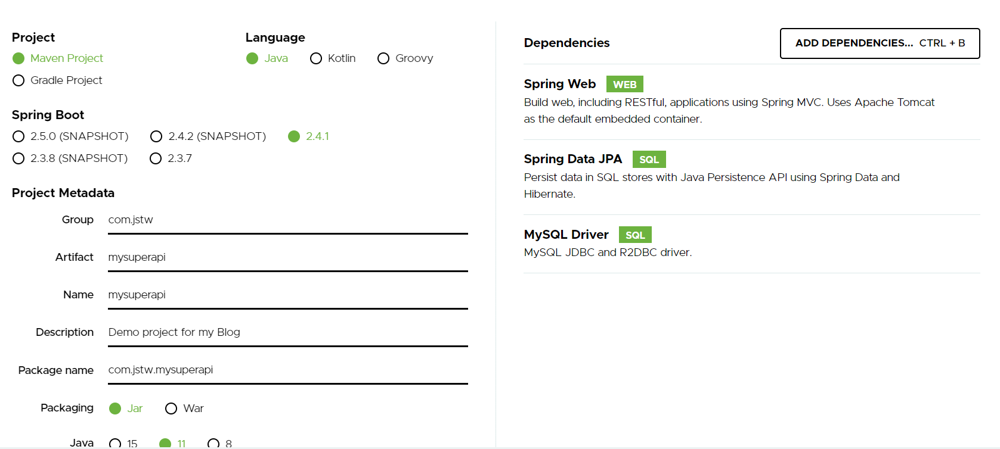
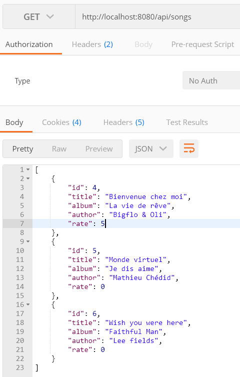
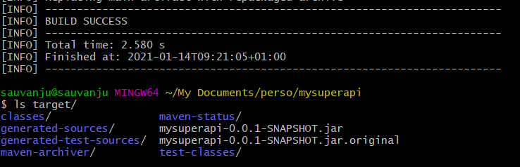
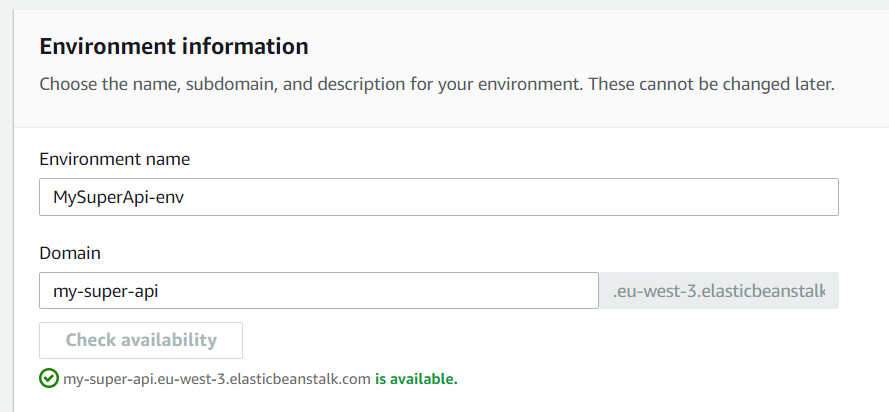
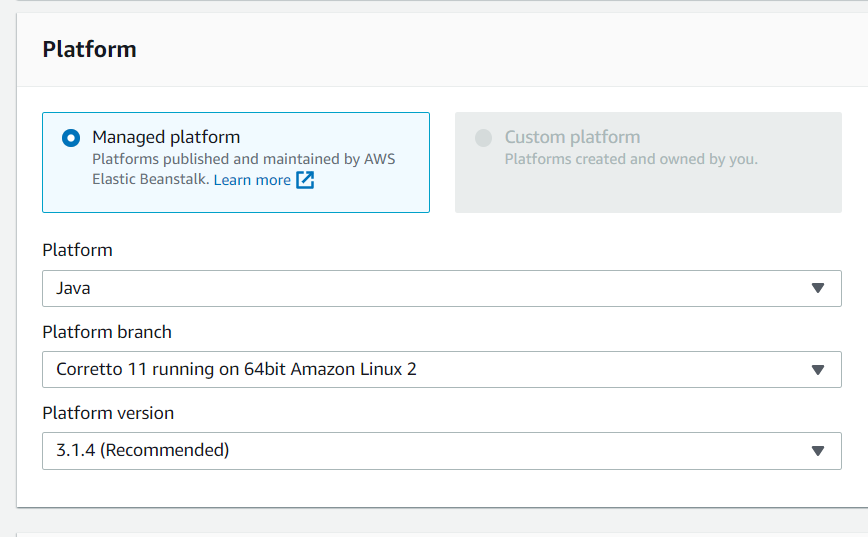
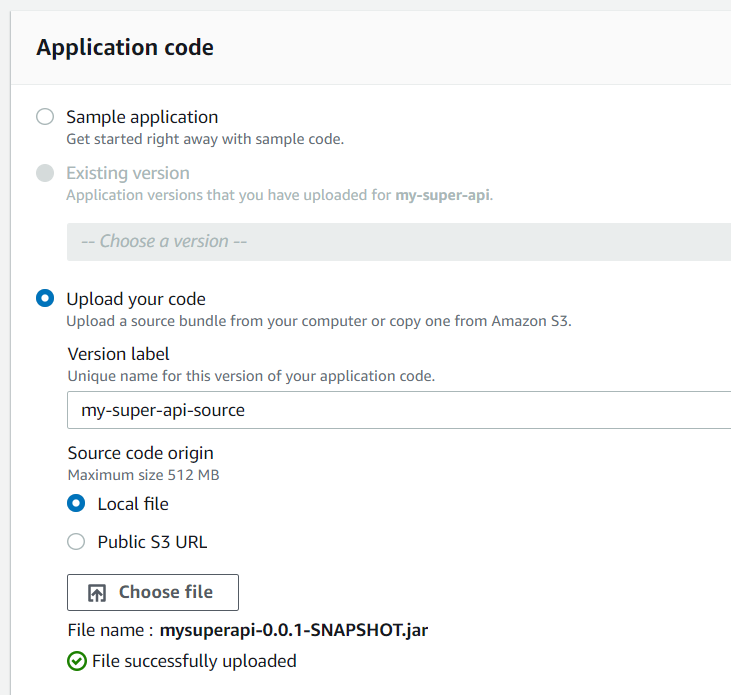
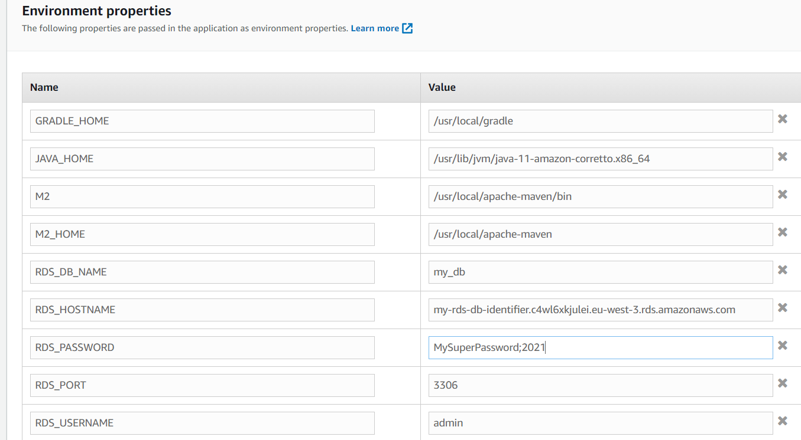
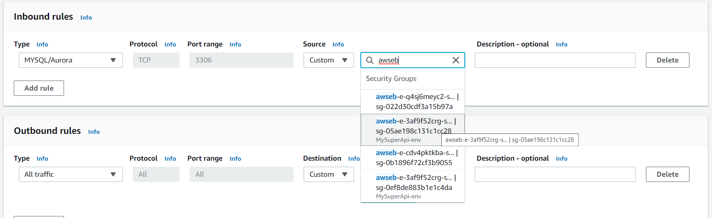
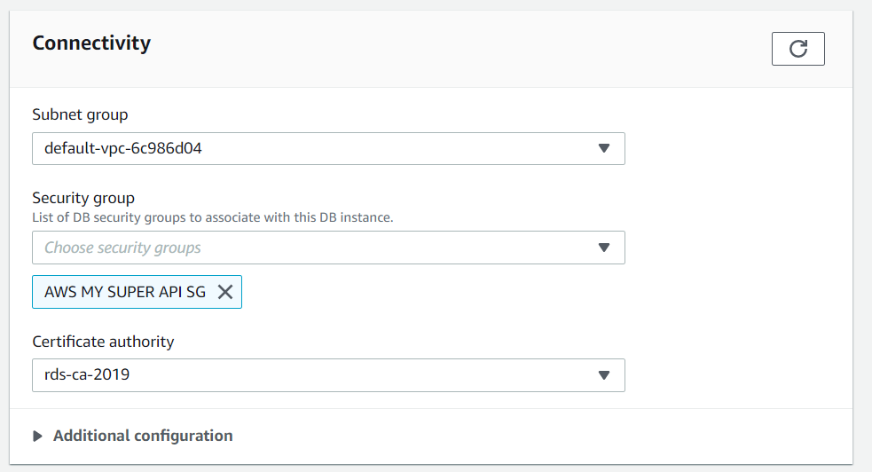
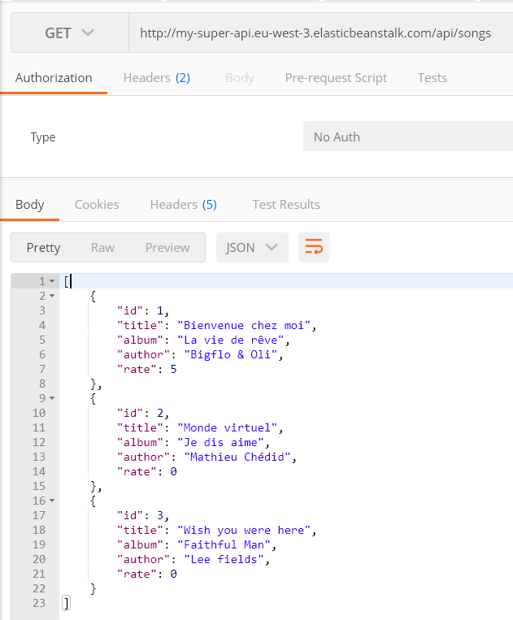

Hello guys!

I didn't publish an article since a while! So today, I wanted to share with how to deals with a REST API built with Spring Boot that communicates with a MySQL database.

Like always, there is a list of pre-requisites that you must have before continuing:

- An AWS account is required ([click here](https://portal.aws.amazon.com/billing/signup#/start) to create one)
- Spring Boot with Java ([click here](https://docs.spring.io/spring-boot/docs/current/reference/html/getting-started.html#getting-started-installing-spring-boot) to download/install)
- MySQL ([click here](https://dev.mysql.com/doc/mysql-getting-started/en/#mysql-getting-started-installing) to download/install)

Ok, let's move on!

---

## Step 1: Spring Rest API
The first step is to initialize our spring boot app with the [Spring Initializer](https://start.spring.io/). Let's create a sample Maven Project (Java 11) like below:




For this example, we will just need 3 dependencies :

- Spring Web — Full-stack web development with Tomcat and Spring MVC
- Spring Data JPA — Java Persistence API including spring-data-JPA, spring-orm, and Hibernate
- MySQL Driver — MySQL JDBC driver

Once it's done, you can click on generate and it will download a zip file that you can extract and import in your IDE.

Next step is to define our DB configuration. For that, create a file in `<< path of your project >>/src/main/resources/application.properties` and put this configuration :

```yaml
# Server configuration
server.port=8080

# Spring
spring.datasource.url=jdbc:mysql://localhost:3306/my_db?useSSL=false
spring.datasource.username=root
spring.datasource.password=root

# Hibernate
# The SQL dialect makes Hibernate generate better SQL for the chosen database
spring.jpa.properties.hibernate.dialect=org.hibernate.dialect.MySQL5InnoDBDialect

# Hibernate ddl auto (create, create-drop, validate, update)
spring.jpa.hibernate.ddl-auto=update
```

Our configuration is done, so the next step is to create our class entity model. It's a simple project, so I will create just a simple one: Song.

Let's create a folder `models` in our application, and create a Java Class Song like below :
```java
@Entity
@Table(name = "songs")
public class Song {
    @Id
    @GeneratedValue(strategy = GenerationType.AUTO)
    private Long id;

    @Column(nullable = false)
    private String title;

    @Column(nullable = false)
    private String album;

    @Column(nullable = false)
    private String author;

    @Column(nullable = false)
    private int rate;

    public Song() {

    }

    public Long getId() {
        return id;
    }

    public void setId(Long id) {
        this.id = id;
    }

    public String getTitle() {
        return title;
    }

    public void setTitle(String title) {
        this.title = title;
    }

    public String getAlbum() {
        return album;
    }

    public void setAlbum(String album) {
        this.album = album;
    }

    public String getAuthor() {
        return author;
    }

    public void setAuthor(String author) {
        this.author = author;
    }

    public int getRate() {
        return rate;
    }

    public void setRate(int rate) {
        this.rate = rate;
    }
}
```

Once our model entity is created, let's create the repository class. Create a folder `repositories` and create a java class called SongRepository with the following code:

```java
@Repository
public interface SongRepository extends JpaRepository<Song, Long> {

}
```

And the latest step for our API is to create the controller to serve the data. Create the latest folder called `controllers` and add a SongController Java Class like below :

```java
@RestController
@RequestMapping("/api")
public class SongController {
    private final SongRepository songRepository;

    public SongController(SongRepository songRepository) {
        this.songRepository = songRepository;
    }

    @RequestMapping(value = "/songs", method = RequestMethod.GET, produces = {MediaType.APPLICATION_JSON_VALUE})
    public List<Song> getAllSongs() {
        return this.songRepository.findAll();
    }
    
    @RequestMapping(value = "/songs", method = RequestMethod.GET, produces = {MediaType.APPLICATION_JSON_VALUE})
    public List<Song> getAllSongs() {
        return this.songRepository.findAll();
    }
}
```

Before starting our application, we need to create the database that we provided in the `application.properties` file. So, connect to MySQL via command line and create your DB as below :
```console
mysql -u root -p
# hit your password

# create the database my_db :
create database my_db;
```

We need to fill a little bit our DB, so I added a new method in our SongController :
```java
@RequestMapping(value = "/init-db", method = RequestMethod.GET, produces = {MediaType.APPLICATION_JSON_VALUE})
public String fillDatabase() {
    Song song1 = new Song();

    song1.setAuthor("Bigflo & Oli");
    song1.setAlbum("La vie de rêve");
    song1.setTitle("Bienvenue chez moi");
    song1.setRate(4);

    Song song2 = new Song();

    song2.setAuthor("Mathieu Chédid");
    song2.setAlbum("Je dis aime");
    song2.setTitle("Monde virtuel");
    song1.setRate(3);

    Song song3 = new Song();

    song3.setAuthor("Lee fields");
    song3.setAlbum("Faithful Man");
    song3.setTitle("Wish you were here");
    song1.setRate(5);

    this.songRepository.save(song1);
    this.songRepository.save(song2);
    this.songRepository.save(song3);

    return "Database has been filled in !";
}
```

Ok so I think we can check if everything is ok by running `mvn spring-boot:run` in your project folder.

Our application run successfully :

```
2021-01-14 08:55:42.067  INFO 12800 --- [           main] o.s.s.concurrent.ThreadPoolTaskExecutor  : Initializing ExecutorService 'applicationTaskExecutor'
2021-01-14 08:55:42.254  INFO 12800 --- [           main] o.s.b.w.embedded.tomcat.TomcatWebServer  : Tomcat started on port(s): 8080 (http) with context path ''
2021-01-14 08:55:42.260  INFO 12800 --- [           main] c.jstw.mysuperapi.MysuperapiApplication  : Started MysuperapiApplication in 3.056 seconds (JVM running for 3.362)
```

Let's first hit our init DB endpoint : ```http://localhost:8080/api/init-db```
and then let's test ```http://localhost:8080/api/songs``` :



Ok congrats folks, our first part is done ;-)

Let's move on now, and start the AWS part.

## Step 2: Creation of the RDS Instance

Open the Amazon RDS service via `Services / Databases / RDS`, and then hit "Create Database".

Let's keep the "Standard create" option and select "MySQL" for the engine options.

For the "Template" part, I will select "Free Tier" because it's a sample project for a demo, but you can adapt the template based on your needs.

In the Settings part, I will change the DB instance identifier by: `my-rds-db-id`. For the credentials I will provide a password: **MySuperPassword;2021**, and let the "master username" as is (**admin** by default).

Chose your DB instance size based on your requirement (for this example I will let the default one: db.t2.micro), same for the Storage part.

I will leave the other default settings (Availability & durability, Connectivity, Database authentication) but the important part will be on the Additional configuration part.

Open the Additional configuration part, and provide the Initial database name: **my_rds_db** and leave the rest as is.

Once is done, click on "Create Database" and it will take a few minutes to provide your DB.

Meanwhile, we will update a little bit our **application.properties** to change the server port and the spring Datasource lines. The server configuration/spring should look like :

```
# Server configuration
server.port=5000

# Spring
spring.datasource.url=jdbc:mysql://${RDS_HOSTNAME}:${RDS_PORT}/${RDS_DB_NAME}
spring.datasource.username=${RDS_USERNAME}
spring.datasource.password=${RDS_PASSWORD}
```

Once it's done, we will build our app by running a: `mvn clean package -DskipTests`

Your artifact should be generated in your `<< project path >>/target/<< project app name >>-0.0.1-SNAPSHOT.jar` like below :



Ok, so I think it's time to create our Elastic Beanstalk application. Let's navigate to this service via `Services / Compute / Elastic Beanstalk`.

Hit **Create a new environment**, keep the default selected environment tier (Web server environment).

Provide an application name: *my-super-api* (for me)
Chose a domain and check is availability:



For the platform, let's select the Java one with the Corretto platform branch :



And finally, we will upload our artefact built previously in the Application code part :



Let's create your environment, It will take a few minutes to do it.

Once it's created, click on your environment and go to the configuration (on the left side menu), and then edit the **Software** category part.

Scroll down and we will need to provide some environment properties like below :



You will find the **RDS_HOSTNAME** value in the RDS section, select your RDS Database, and then find in the Connectivity & Security tab the endpoint value.

Save these properties, and now we will need to create a new security group for our ELB Security Group to authorize the communication between MySQL and our ELB Instance.

For that, let's navigate to `Services / Compute / EC2`, and then click on "Security Groups" on the left menu.

Create a new security group, provide a name and attach it to your default VPC or the VPC you created (if you created a custom one).

The next step is to provide an Inbound rule, that will allow the TCP 3306 from our Elastic Beanstalk app. Chose a type "MySQL / Aurora", it will automatically provide the protocol TCP and port 3306, and then for the source select the EC2 Security Group associated to your ELB app (you can find it in the ELB Section / Configuration / EC2 security groups) :



Finally, let's go to your RDS Database, click on **Modify** :

Leave all as is, but in the "Connectivity" part, remove the default security group and add the new one created previously :



Click on Continue, and do not forget before modifying your DB instance to select `Apply immediately` option. Then click on Modify DB instance.

Ok, guys, we are done with the AWS configuration part, so the latest step is to test our API :)

Let's go back to your ELB App, and copy your environment URL. For me, it will be: `http://my-super-api.eu-west-3.elasticbeanstalk.com`.

Let's do the same thing we did in local, by opening first the "init DB endpoint": 
```
http://my-super-api.eu-west-3.elasticbeanstalk.com/api/init-db

# and then check the songs endpoint :
http://my-super-api.eu-west-3.elasticbeanstalk.com/api/songs
```

Finally, we can see our data:



Congrats guys, your API is now working on AWS :)

Let's summarize what you achieve during this tutorial :

- You created a REST API with SpringBoot Framework in Java 11
- You created and configured an RDS Instance with a MySQL Database in AWS
- You created an Elastic Beanstalk application
- You configured a Security Group to allow exchanges between your RDS Instance and the ELB App.

I hope it was helpful for you, see you next time!
