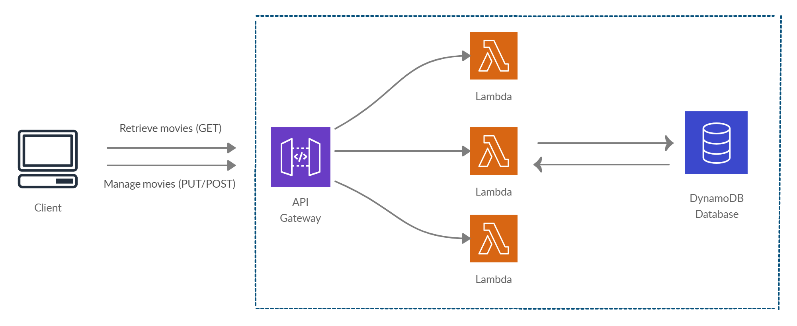
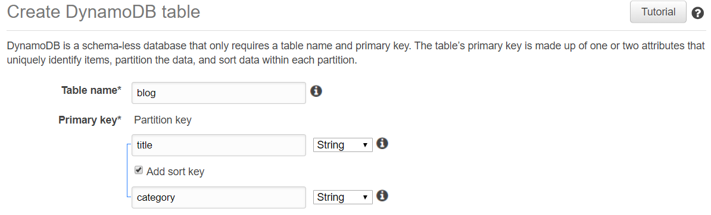
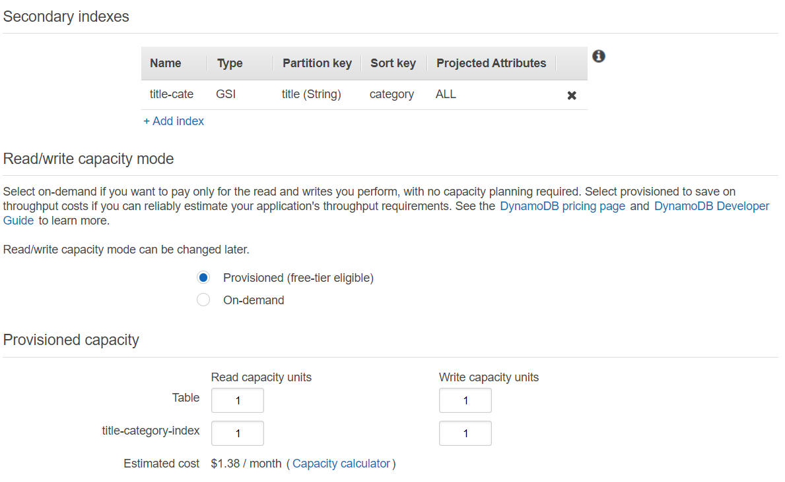
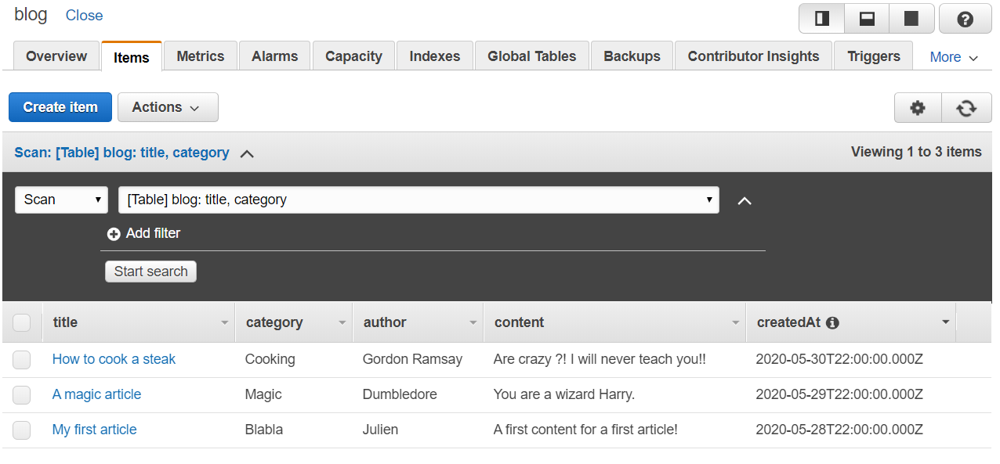

Hey there! This is my first post on my new blog ;-)

In this article we will have a look on how we can create a web application without handling any server architecture/installation.

This kind of architecture is called "serverless". You can have a look in this [great article](https://hackernoon.com/what-is-serverless-architecture-what-are-its-pros-and-cons-cc4b804022e9) what it is.

Let me show you what we will implement in this tutorial :



> Before going further, you will need an AWS Account (to create one, please visit [this link](https://portal.aws.amazon.com/billing/signup#/start))

So first, we are going to use an AWS user that has the admin rights. I recommend you connect to your root account, create an "admin" user and attach the `AdministratorAccess` policy.

When it's done, please connect to your AWS Account through the IAM users sign-in links.

| Be careful: For the entire article, I wil use the region eu-west-2. You can choose every region you want, but do not forget to create all the keep the same region for all your future created resources!
| --- |

###First step: Create the Database (DynamoDB)

I will use a no NoSQL Database, DynamoDB. If you are curious and if you want more information about this database I provide you [this link](https://cloudacademy.com/blog/amazon-dynamodb-ten-things/) which describes perfectly what is DynamoDB.

Navigate to the DynamoDB service  via `Services > Database > DynamoDB`.

Ok once you are here, we will create our blog table. Hit the `Create Table` button and fill the form like below :



When you create a DynamoDB table, a `partition key` is required to identify uniquely each item in your table.
But this primary key can also be composed of a `sort key`.

The partition key is used for partitioning the data. Data with the same partition key is stored together, which allows you to query data with the same partition key in 1 query.

The (optional) sort key determines the order of how data with the same partition key is stored. Using a clever sort key allows you to query many items in 1 query.

###Second step: Configure our DynamoDB table settings

Our settings will be simple, I will just create one Global Secondary Index (GSI) which is composed on our partition key, `title`, and our sort key, `author`. GSIs can be created only at the table creation and not after.

> For the Read/Write capacity mode, it just an example so I'll change them to have the minimum of Read capacity units (RCUs) and Write capacity units (WCUs). Of course, if you intent to use this Database in your project, you will adapt the RCUs/WCUs and probably use the Auto-Scaling based on your demand.



Once your DynamoDB settings are ready, feel free to hit the `Create` button and your table will be created in few seconds.

Ok so once its created, you can provide some "Items" to fill a little bit your table.

I provide you a following list of items that you can add :

```json
[
  {
    "title": "My first article",
    "author": "Julien",
    "category": "Blabla",
    "content": "A first content for a first article!",
    "createdAt": "2020-05-28T22:00:00.000Z"
  },
  {
    "title": "A magic article",
    "author": "Dumbledore",
    "category": "Magic",
    "content": "You are a wizard Harry.",
    "createdAt": "2020-05-29T22:00:00.000Z"
  },
  {
    "title": "How to cook a steak",
    "author": "Gordon Ramsay",
    "category": "Cooking",
    "content": "Are crazy ?! I will never teach you!!",
    "createdAt": "2020-05-30T22:00:00.000Z"
  }
]
```

> At this step, you should have your Blog table which contains 3 items :



Well done! Our DynamoDB is ready to be used :) Feel free to move on [to the Part 2](./../serverless-api-with-lambda-part-2) to start to configure our lambdas to query our DB.