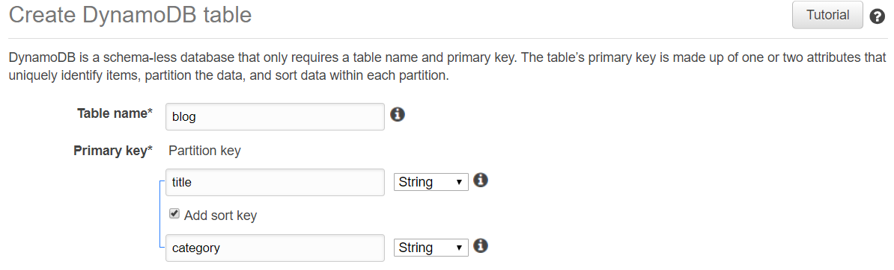
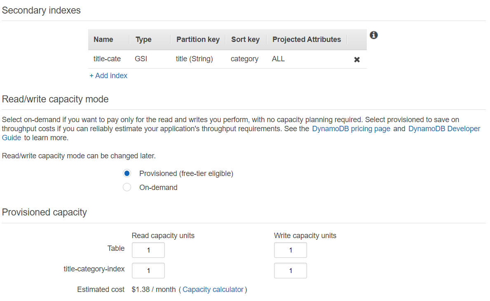
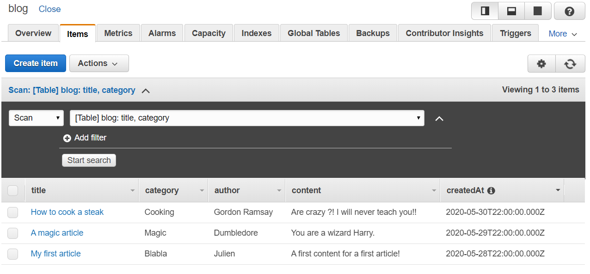

Hey there! This is my first post on my new blog ;-)

In this article, we will have a look at how we can create a web application without handling any server architecture/installation.

This kind of architecture is called "serverless". (more information [here](https://hackernoon.com/what-is-serverless-architecture-what-are-its-pros-and-cons-cc4b804022e9)).

Let me introduce you the architecture our the application :


As you can see, it's a very simple architecture. We don't have to create so many resources to get a functional web app.

Our goal here is to have a Client-Side application (developed in ReactJS), which will query an API (through API Gateway). Finally, this API will deserve some Lambda Functions that will interact with our DynamoDB database.

Before going further, there is a list of pre-requires :
- You should have an AWS Account (to create one, please visit [this link](https://portal.aws.amazon.com/billing/signup#/start))
- [CURL](https://curl.haxx.se/download.html) or [Postman](https://www.postman.com/) to query our database.
- Node Package Manager ([npm](https://www.npmjs.com/get-npm)) or other package managers like [yarn](https://classic.yarnpkg.com/en/docs/install/#windows-stable).

> I recommend connecting to your root account if you don't have one, go to the IAM Dashboard and create an "admin" user. Once is done, attach the `AdministratorAccess` policy.

> **Be careful**: For the entire article, I will use the region **eu-west-2**. You can choose every region you want, but do not forget to create all the same region for all your future created resources!

Let's start then :) Connect to your AWS Account by using the IAM users sign-in link.

###First step: Create the Database (DynamoDB)

I will use a no NoSQL Database, **DynamoDB**. If you are curious and if you want more information about this database I provide you [this link](https://cloudacademy.com/blog/amazon-dynamodb-ten-things/) which describes perfectly what is DynamoDB.

Let's navigate to the DynamoDB service  via `Services > Database > DynamoDB`.

Once you are here, we will create our blog table. Hit the `Create Table` button and fill the form like below :



> When you create a DynamoDB table, a `partition key` is required to identify uniquely each item in your table.
But this primary key can also be composed of a `sort key`.

> The partition key is used for partitioning the data. Data with the same partition key are stored together, which allows you to query data with the same partition key in 1 query.

> The (optional) sort key determines the order of how data with the same partition key is stored. Using a clever sort key allows you to query many items in 1 query.

###Second step: Configure our DynamoDB table settings

Our settings will be very simple. I will just create 1x **Global Secondary Index (GSI)** which is composed with a partition key (`title` here), and a sort key, `category`. GSIs can be created only at the table creation and not after.

> For the Read/Write capacity mode, I will change them to have a minimum of Read Capacity Units (RCUs) and Write capacity units (WCUs). Of course, if you intend to use this Database in a real production environment, you will adapt the RCUs/WCUs and perhaps use the Auto-Scaling, based on your application charge.



Once your DynamoDB settings are ready, feel free to hit the `Create` button and your table will be created in a few seconds.

Once your database is available, you can provide some "Items" for later usage.

This is a basic list of items that you can provide :

```json
[
  {
    "title": "My first article",
    "author": "Julien",
    "category": "Blabla",
    "content": "A first content for a first article!",
    "createdAt": "2020-05-28T22:00:00.000Z"
  },
  {
    "title": "A magic article",
    "author": "Dumbledore",
    "category": "Magic",
    "content": "You are a wizard Harry.",
    "createdAt": "2020-05-29T22:00:00.000Z"
  },
  {
    "title": "How to cook a steak",
    "author": "Gordon Ramsay",
    "category": "Cooking",
    "content": "Are crazy ?! I will never teach you!!",
    "createdAt": "2020-05-30T22:00:00.000Z"
  }
]
```

> At this step, you should have your Blog table which contains 3 items



Well done! Our DynamoDB is ready to be used :) Feel free to move on [to the Part 2](./../serverless-api-with-lambda-part-2) to start to configure our lambdas to query our DB.
