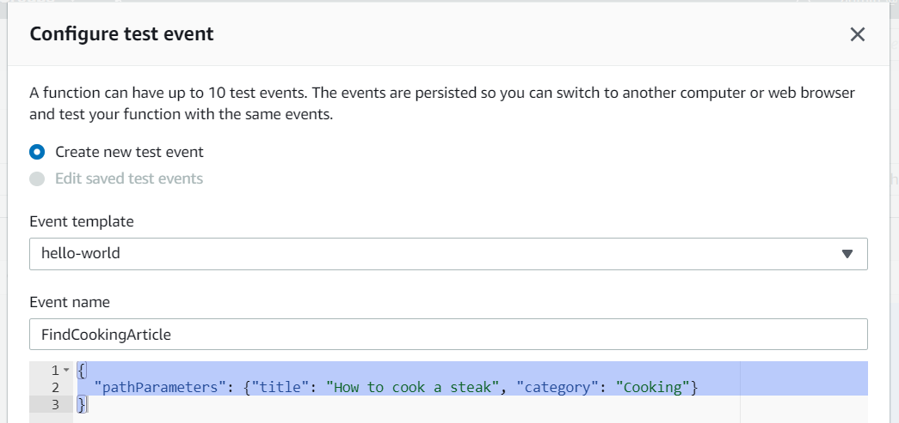

Hey folks! If you didn't read the previous post, I suggest you to [read it](../serverless-api-with-lambda-part-1)  before continuing. If you did, let's continue!

At this step, you normally have a beautiful database which only asking to be queried. Let's move on to the first step.

###First step: define our Lambda Role

Yeah I know, you wanted to start coding a little bit, but you have to wait again :)

If you remember our architecture schema :


Our Client-Side App will query our API. The API Gateway will invoke some Lambda Functions, and those lambda will interacts with our DynamoDB blog table.

But, to allow those interaction between our different AWS Services, we must configure an **IAM role** with particular **IAM policies**.

> If you want to know what are the IAM roles, why we need them, I'll provide you the link to the  [IAM AWS Official Documentation](https://docs.aws.amazon.com/IAM/latest/UserGuide/id_roles.html). 

Let's navigate to the IAM Service through `Security, Identity, & Compliance > IAM`.

Before creating our IAM role, we will create the policy which will be attached to our role. For that, click on `Policies > Create Policy`.

> By default, an explicit deny is set to all resources created in AWS. You must grant permissions via IAM Policies. and attach them to your resources. In you want more informations about IAM Roles, Policies, Groups, have a look [to the officiel documentation of IAM](https://docs.aws.amazon.com/IAM/latest/UserGuide/id.html).

Choose the `JSON` editor tab and copy paste this following JSON policy :
```json
{
    "Version": "2012-10-17",
    "Statement": [
        {
            "Effect": "Allow",
            "Action": [
                "dynamodb:Query",
                "dynamodb:DeleteItem",
                "dynamodb:GetItem",
                "dynamodb:PutItem",
                "dynamodb:Scan",
                "dynamodb:UpdateItem"
            ],
            "Resource": [
                "arn:aws:dynamodb:*:*:table/*/index/*",
                "arn:aws:dynamodb:<< put your region here >>:<< insert your account id here >>:table/blog"
            ]
        },
        {
            "Effect": "Allow",
            "Action": [
                "lambda:InvokeFunction"
            ],
            "Resource": "*"
        }
    ]
}
```

> Do not forget to change the **region** and the **account id** inside the **Resource arn** bloc. The region is the one selected in the AWS Console navigation bar, and your account id can be found by checking the IAM users sign-in link in the IAM Dashboard.

Finally, you can hit the Next button to review your policy, add a name and create your policy. You should have  a screen like this :


Let me explain a little bit what this policy does. The first `Effect` will allow our resources (lambdas) to make some basics interactions with DynamoDB, for example: **Query, Scan or PutItem** etc. For these specifics actions, we should fill the ARNs of our DynamoDB table/indexes.

> You always should follow one of the best practice in AWS, the [Principle of Least Privileges](https://docs.aws.amazon.com/IAM/latest/UserGuide/best-practices.html#grant-least-privilege).

I will not explain the second effect bloc (the **lambda:InvokeFunction**) for now, I'll keep it for later.

Our IAM Policy has been created and we can finally create our IAM Role. Go back to the IAM Dashboard (`Services > Security, Identity & Compliance > IAM`). Click on `Roles > Create a role`.

Keep the first selected option (trusted entity), then chose `Lambda` and click to `Next: Permissions`. Search our policy previously created by typing his name and select it like below :


You can now click on the `Next: Tags` and click on `Next: Review` to finally give a name to your role and create it.


Good job! Your role is now ready to be used. I think it's time for coding!

You can now navigate to the Lambda Service trough: `Services > Compute > Lambda`.

###Second step: Create our lambda functions

We will start to create a first Lambda Function which will basically read out the content of our DynamoDB blog table.

So hit the `Create Function` button and keep the selected creation option (Author from scratch). Choose a name for your Lambda Function, `GetArticles` for example, and go for the `Python 3.8` language runtime.

Before creating our function, one last important step is to select our IAM Role previously created. Open the Permissions just below, click on `Use an existing role` and select your service role from the selected list like this:


Then create your function. you will be redirected to your Lambda.

Scroll down a little bit to your Lambda Code Editor. In this Lambda, we just want to retrieve all Articles from our table. For that, we will use the `Scan` operation that will just basically reads every items in a table. (More information [here](https://docs.aws.amazon.com/amazondynamodb/latest/developerguide/Scan.html)).

Copy/paste this following code in the editor :

```python
# Boto is the Amazon Web Services (AWS) SDK for Python
import boto3

# To interact with DynamoDB, I just need to specity what resource I will use from boto3 (here: dynamodb)
dynamodb = boto3.resource('dynamodb')

# Now I specify which table in DynamoDB I want to interact with.
table = dynamodb.Table('blog')
    
def lambda_handler(event, context):
    try:
        # Here, I will use a scan operation, to retrieve ALL my table items.
        response = table.scan()
        
        # Finally, I just return all the Items I found.
        return response['Items']
    except Exception as e:
        # If an exception was thrown, I just catch it to print a log, and then I raise the error.
        print('An error occured while retrieving Movies table.')
        raise e
```

No more explanations needed for this code, its quite simple, we just import the boto3 library to use the Dynamodb client. We surround our scan operation with the try/catch operator and finally we return the Items.

You can now this Lambda code by clicking `Save` at the top of the page, and now it's time for testing :)

Just near the Save button, you have the possibility to create a `Test Event` to trigger our function handler.

> FYI: Every AWS Lambda function contains at least 2 parameters :

> **event** – AWS Lambda uses this parameter to pass in event data to the handler.

> **context** – AWS Lambda uses this parameter to provide runtime information to your handler.

Click on the `Test` button, choose an event name (For example: TestGetItems) and leave the rest as is. Your `TestGetItems` is now part of your tests events. Ready to test your lambda ? Push the test button again ;)

Normally you should see a success box like this :


Well, I think we can claim our first beer, we successfully created our first lambda which reads our DynamoDB items, congrats!

### Third step: Create the other lambda functions

The other Lambda will basically represents all the CRUD operation you can found in an API. Remember, the goal is to call these Lambda functions with API Gateway.

So this is what is remaning for our Lambda :
- Retrieve all blog articles (GetArticles - done)
- Find an article by title and category (FindByTitleAndCategory - TBD)
- Create an article (CreateArticle - TBD)
- Update an article (UpdateArticle - TBD)
- Delete an article (DeleteArticle - TBD)

Let's move on! Go back to the main Lambda screen, by clicking `Services > Compute > Lambda`. Then, do the same job like you did before by clicking `Create Function`. Keep the same settings we did for the **GetArticles** Lambda function.

This time, we will tackle our second lambda in the list, the `FindByTitleAndCategory`. Lambda settings should be the same :


> Do not forget to attach our IAM role.

Copy/paste this following Python code :

```python
import boto3
# This new import will be use to specify which DynamoDB Key we use in the KeyConditionExpression.
from boto3.dynamodb.conditions import Key
 
client = boto3.resource('dynamodb')
table = client.Table('blog')
    
def lambda_handler(event, context):
    try:
        # I'll explain you later why we take these values from the event "pathParameters" property.
        title = event['pathParameters']['title']
        category = event['pathParameters']['category']
        
        # This time, we will use the query operation.
        response = table.query(
            ProjectionExpression="title, category, author, content, createdAt",
            KeyConditionExpression=Key('title').eq(title) & Key('category').eq(category)
        )
       
        return response['Items']
    except Exception as e:
        print('An error occurred while retrieving an item in blog table.')
        raise e
```

In this lambda we just need to specify which fields we want to expose in our response thanks to the `ProjectionExpression`.

The second one (the most important) is the `KeyConditionExpression` which will determine our conditional query expression (which article we want to query).

> You can find [here](https://docs.aws.amazon.com/amazondynamodb/latest/developerguide/Query.html) the official documentation of a Query operation.

Save your function, add a new test event but this time we will have to change a little bit the test event content by adding the requested params (title and category) :



> Do not pay attention of our test event structure, but please respect it.

Once your event has been created, just hit the Test button again and let's see what we received :)


This time, we just received 1 item based from the value passed in the test event. Our FindBy Lambda is now operational!

Let's move on, and make the `CreateArticle` one. Same process like before, create a new Lambda function with the same settings.

Copy/paste this following code :
```python
import json
import boto3
from datetime import datetime
from botocore.exceptions import ClientError
        
dynamodb_client = boto3.resource('dynamodb')
table = dynamodb_client.Table('blog')

lambda_client = boto3.client('lambda')
    
def lambda_handler(event, context):
    try:
        # here, we want to handle both cases: if we receive a body as string, or a body as object.
        if type(event['body']) == str:
            body = json.loads(event['body'])
        else:
            body = event['body']
        
        # we extract this 2 properties to retrive the item inserted after.
        title = body['author']
        category = body['category']
        
        createdAt = datetime.now().strftime('%Y-%m-%dT%H:%M:%SZ')
        
        response = table.put_item(
            Item={
                'title': title,
                'category': category,
                'author': body['author'],
                'content': body['content'],
                'createdAt': createdAt
            }
        )
        
        # According to the documentation, We can set a ReturnValues='ALL_NEW' property in our PutItem operation.
        # But the the ALL_NEW isn't accepted for put_item.
        
        # The other solution is to re-query our database to get the item created.
        
        # But, re-query the DB is just re-triggering the same Job we did
        # in our FindByTitleCategory lambda.
        
        # We have the possibility to invoke another Lambda in our Lambda
        invoke_response = lambda_client.invoke(
            FunctionName="FindByTitleCategory",
            InvocationType='RequestResponse',
            Payload=json.dumps({"pathParameters": {"title": title, "category": category}})
        )
        
        # Finally, we need to convert our response in an object and return the
        # payload received from our Lambda
        item = json.loads(invoke_response['Payload'].read().decode("utf-8"))
    except ClientError as e:
        print('An error occured while trying to insert a new movie')
        raise e
        
    return item
```

Before configuring our test event, just some clarifications about this portion of code: 
- First, to retrieve the body sent by the POST action, we want to handle the fact that the object passed in the body can be an object, but also a stringified object. That's why we check the type of the `event body`.
- Then, we use the `put_item` operation by simply passing the Item that we want to insert in database.
- Finally, the official documentation is not really clear, but it's impossible to retrieve the item created when we use the **put_item** action. We need to query the DB again. But if you remember, we created already a Lamba (**FindByArticleAndCategory**) which is doing exactly what we want to retrieve an item. That's why we added the **Lambda:InvokeFunction** policy in our IAM Role :) So when the **put_item** is done, we just invoke our **FindByArticleAndCategory** Lambda Function to retrieve our article created by providing his title and his category. It's not the only way, and probably the right way to do that, but it's one of the possibility to do it. The other one is to query directly the database like we did in the FindByArticleAndCategory Lambda,.

Ok so let's create our test event :


Before testing our Lambda Function, because this one is a little bit more "tricky" than the other one, it's possible to have some timeout when executing it. To avoid this problem, I suggest for this example to increase a little bit the "default" lambda settings. For that, change default timeout timer, up 3 to 10 seconds in the Lambda settings :
 


> Same as DynamoDB's RCU and WCU, if you want to use this Lambda in a real production stage, please adapt yhe settings in consequence (Memory, timeout etc.).I provide you a great article for [choosing the right amount of memory for an AWS lambda](https://medium.com/@raupach/choosing-the-right-amount-of-memory-for-your-aws-lambda-function-99615ddf75dd)

I think we can test our Create Lambda function, so hit the Test button and you should have this results :


Nice, the most difficult Lambda part has been done! The others one will be more easier.

Let's tackle the `UpdateArticle` Lambda. Create a new lambda and provide this code :

```python
import json
import boto3
from botocore.exceptions import ClientError
from boto3.dynamodb.conditions import Key
        
dynamodb_client = boto3.resource('dynamodb')
table = dynamodb_client.Table('blog')
    
def lambda_handler(event, context):
    try:
        if type(event['body']) == str:
            body = json.loads(event['body'])
        else:
            body = event['body']
        
        # here we retrieve the same parameters as the FindBy lambda
        # to identify what item to update.
        title = event['pathParameters']['title']
        category = event['pathParameters']['category']
        
        # we will use the update_item in this case
        response = table.update_item(
            Key={
                'title': title,
                'category': category
            },
            UpdateExpression="set content = :content, author = :author",
            ConditionExpression="title = :title AND category = :category",
            ExpressionAttributeValues={
                ':title': title,
                ':category': category,
                ':content': body['content'],
                ':author': body['author']
            },
            ReturnValues="ALL_NEW"
        )
        
        return response['Attributes']
    except ClientError as e:
        if e.response['Error']['Code'] == "ConditionalCheckFailedException":
            print(e.response['Error']['Message'])
        else:
            raise e
```

For this portion of code, we will need the primary key identifier to determinate which object we want to update.

Remember, when we created our DynamoDB table, we specified a **partition key** (title), and a **sort key** (category) which represent our **primary key**.

It means that if we want to make some actions in a particular item in our table, we have to specify these two properties.

Good news: For the **update_item** operation, we can specify the `ReturnValues="ALL_NEW"` property which will return the complete object updated.

> You have also the possibility to return only the attributes changed by changing the ReturnValues value. [See here](https://docs.aws.amazon.com/amazondynamodb/latest/APIReference/API_UpdateItem.html#API_UpdateItem_RequestSyntax) the possible values of the **ReturnValues** property.

In this lambda, I decided to update my item with Conditional Expressions. It means that it will update my item only if its respect the **ConditionsExpressions**. If not, it will raise a **ConditionalCheckFailedException**.

> You can have a look on what are [conditions expressions](https://docs.aws.amazon.com/amazondynamodb/latest/developerguide/Expressions.ConditionExpressions.html).

Let's configure our test event and test it just after :


As you can see, this is what we received :


And if we check our DynamoDB blog table :


Finally, let's implement the latest one, create the DeleteArticle Lambda Function and provide this code :

```python
import json
import boto3
from botocore.exceptions import ClientError
from boto3.dynamodb.conditions import Key
        
dynamodb_client = boto3.resource('dynamodb')
table = dynamodb_client.Table('blog')
    
def lambda_handler(event, context):
    try:
        title = event['pathParameters']['title']
        category = event['pathParameters']['category']
        
        response = table.delete_item(
            Key={
                'title': title,
                'category': category
            }
        )
        
        return response
    except ClientError as e:
        print(e.response['Error']['Message'])
        raise e
```

And the test event :


Let's try your Delete Lambda function and your item is now deleted from your table :


### Let's summarize
- We created our IAM **admin** user
- With the admin user, we created the **policy** that **allows our Lambdas to interact wich our DynamoDB**.
- We **attached this policy to our IAM Role**.
- We created **5** Lambda Functions :
   - **GetArticles** (which list all articles from blog table)
   - **FinByTitleAndCategory** (which list an article based from his primary key)
   - **CreateArticle** (which create an article item in blog table)
   - **UpdateArticle** (which update an article based from his primary key)
   - **DeleteArticle** (which delete an article based from his primary key)
   
Woah, we did a great job, congrats. Let's move on now to the latest part, the [creation of our API Gateway](../serverless-api-with-lambda-part-3).