Hey hello there! If you didn't read the previous post, I suggest you to [read it](./../serverless-api-with-lambda-part-2) before continuing. If you did, perfect, let's continue ;)

The last part is to integrate our Lambda Functions previously created, in the AWS API Gateway service. Find this service, by opening `Services > Networking & Content Delivery > API Gateway`.

Let's create an API by clicking the `Create API` button.

We can choose some types for our API, but in this case, we want to create an HTTP API. So let's keep the first selected option.

Provide a name, **blog-api** for example, and let's integrate our Lambdas by adding them one by one in the `Create and configure integrations` like below :

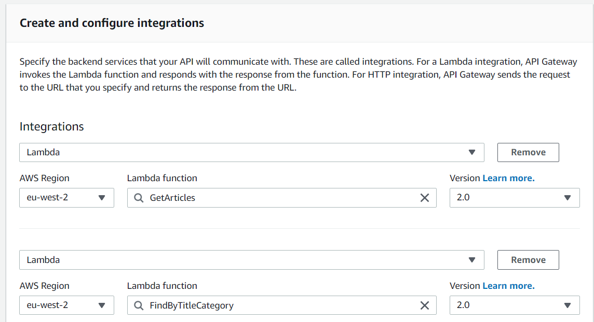
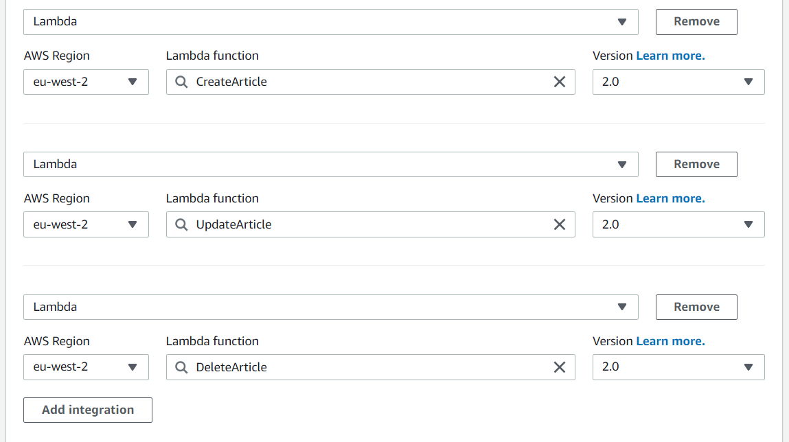

Now our Lambdas are integrated. Let's create our **routes** and configure them like this :

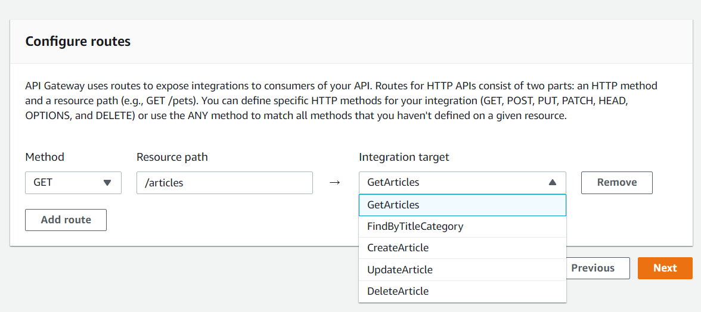

Please be sure to have the same URL as below :

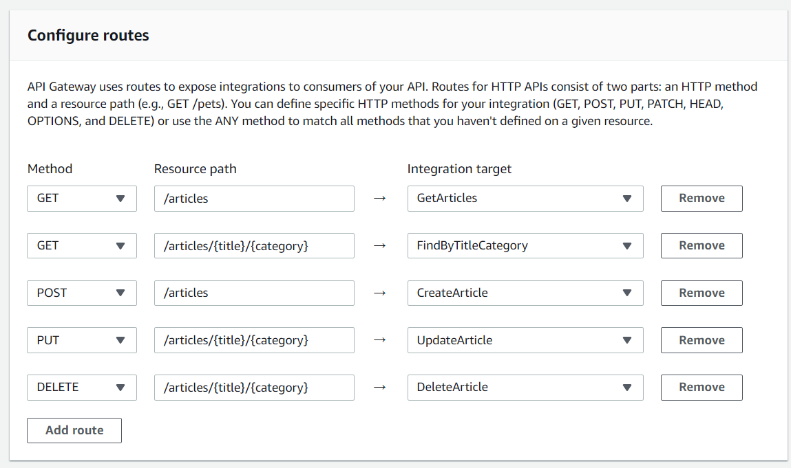

You can now click on **Next** and leave the configuration stages as is. Review your API creation, and if it respects all the configuration above, you can hit the **Create** button.

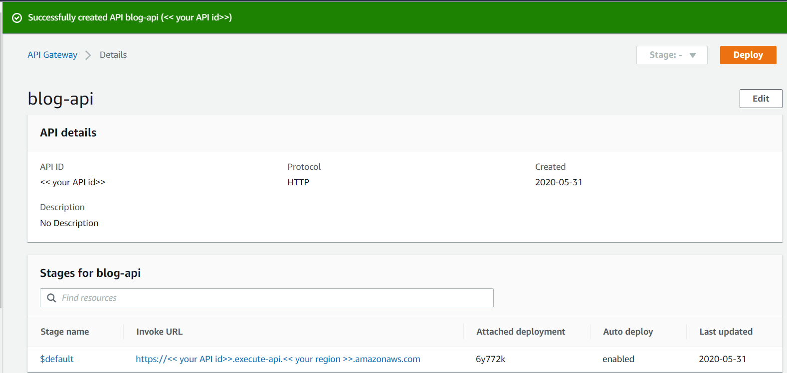

Good job, your API is now created! You can find your API URL in your **stages**. It should be in the Invoke URL column.

### Let's test the beast!

I don't know what you prefer to test your API, you can CURL or Postman, it's up to you :)

I will go for curl :

**GetArticles:** 
```batch
curl -v -X GET '<< your api url>>/articles'
```
*Output:*
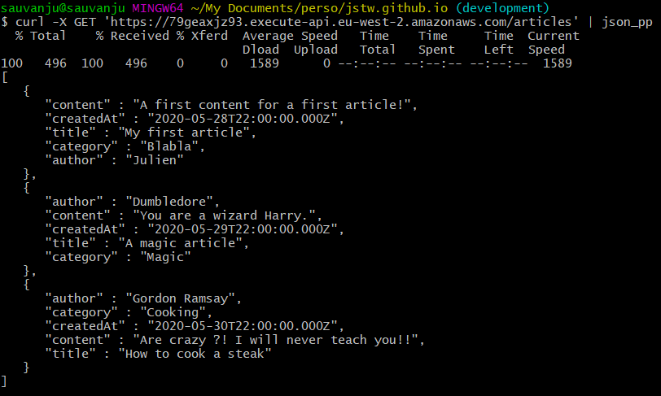

**FindArticleByTitleAndCategory:** 
```batch
curl -v -X GET '<< your api url>>/articles/My%20firs%20article/Blabla'
```
*Output:*
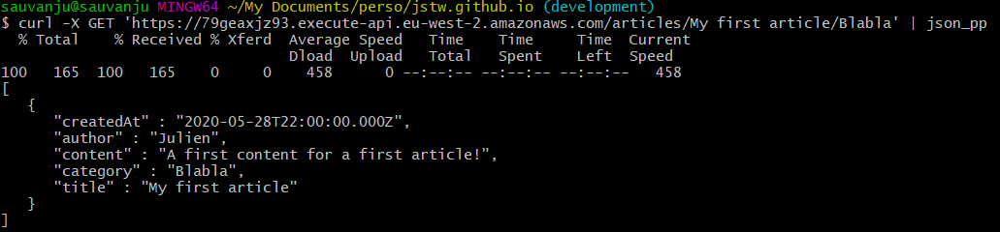


**CreateArticle:** 
```batch
curl -d '{
   "title": "My CURL Article",
   "category": "Test",
   "content": "An article created via CURL command, awesome!",
   "author": "Julien"}' -H "Content-Type: application/json" -X POST << your api url >>/articles | json_pp
```
*Output:*
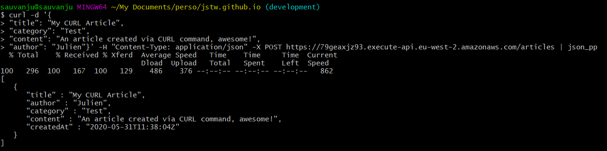


**UpdateArticle:** 
```batch
curl -d '{
   "content": "Oh, this is a curl update ?",
   "author": "CURLUser"}' -H "Content-Type: application/json" -X PUT << your api url >>/articles/My%20CURL%20Article/Test | json_pp
```
*Output:*
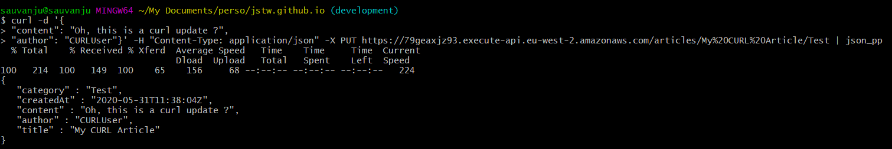

**DeleteArticle:** 
```batch
curl -X DELETE '<< your api url>>/articles/My%20CURL%20Article/Test'
```
*Output:*
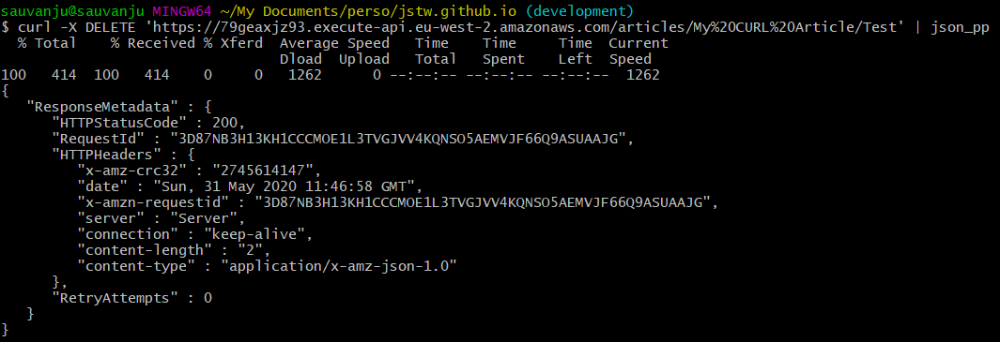

---

Perfect our API is working successfully! Let's download our ReactJS application to test it in live :)

You can find in my Github account, a sample project which is available to test your API. You can clone it via the command line (if you have git installed) : 

```batch
git clone git@github.com:JStw/blog-app.git
// or via https :
git clone https://github.com/JStw/blog-app.git
```

When it's done, run an `npm install`.

Open the `App.js`, and put your API Gateway base URL in this line :

```javascript
export const API_BASE_URL = 'put your API base URL here (do not put the /)';
```
Before starting the app, you should enable CORS by adding the `http://localhost:3000` Origin. If you don't do that, it will be impossible for your app to query your API.

Navigate to the API Gateway Services, and click on the `CORS` option in the left menu. Edit the configuration, and add http://localhost:3000 to the **Access-Control-Allow-Origin** list :


Once it is done, save and go back to the React App project.

Run `npm start` and when the app will run, it will open a new tab with the following URL: `http://localhost:3000`.
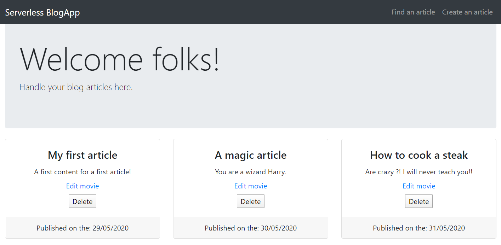

> If the port has changed because you have already something running on the 3000 port, please edit your CORS configuration by setting the correct port in your API Gateway.

I hope this article was helpful for you like I said this is my article guys, so it will not be perfect... but if you want to send me feedback do not hesitate to contact me in DM via Twitter or my other social links :) Thank you for your time!

### Go further
Now your API is working, this is some extra-work you can do :
- Secure some API calls with Cognito.
- Send SMS / Email to your subscriber's list
- Customize domain name for your API
