Hey hello there! If you didn't read the previous post, I suggest you to [read it](./../serverless-api-with-lambda-part-2) before continuing. If you did, perfect, let's go ;)

The last part is to integrate our Lambda Functions previously created, in a API. AWS provides a really great service for that, which is called **API Gateway**.

Find this service, by opening `Services > Networking & Content Delivery > API Gateway`.

Let's create an API by clicking the `Create API` button.

We have the possibility to chose some types for our API, but in this case we want to create an HTTP API. Let's choose the `HTTP API` (the first one).

Provide a name **blog-api** for example, and let's integrate all Lambdas by adding them one by one in the `Create and configure integrations` like below :

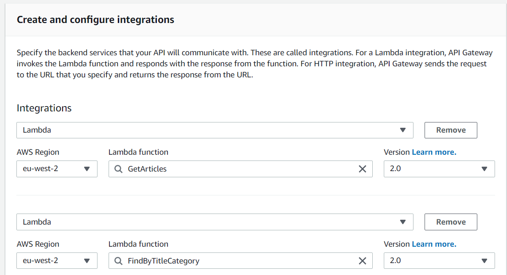
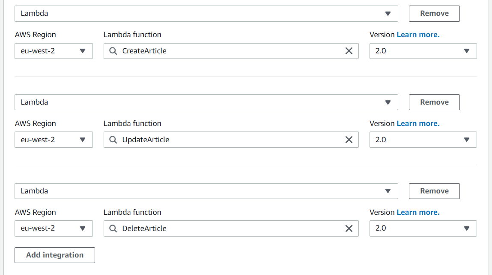

Now our Lambda are integrated, let's create our **routes** and configure it like this :

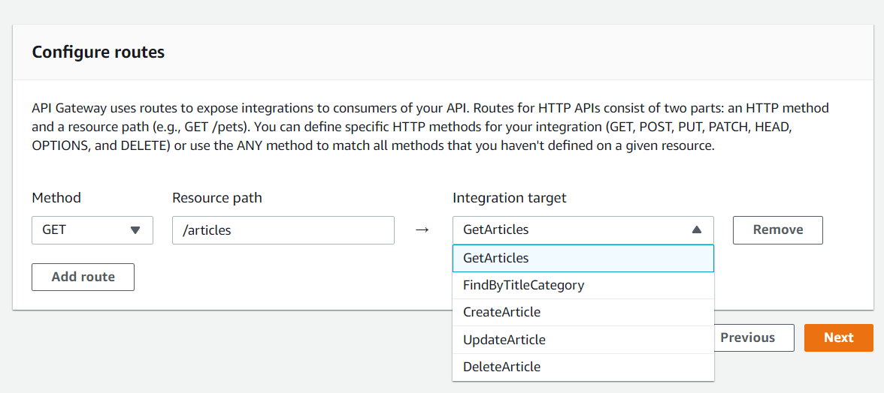

Please be sure to have the same URL as below :

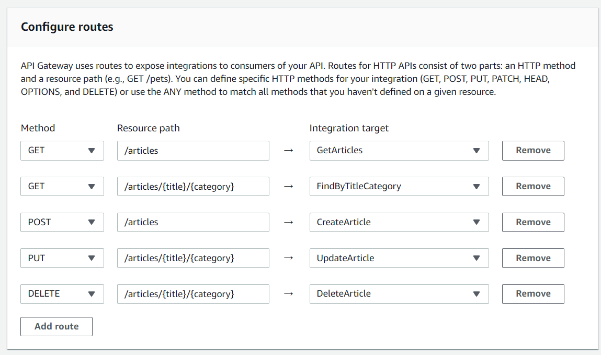

You can now click on **Next** and leave the configuration stages as is. Review your API creation, and if it's respect all the configuration above, you can hit the **Create** button.

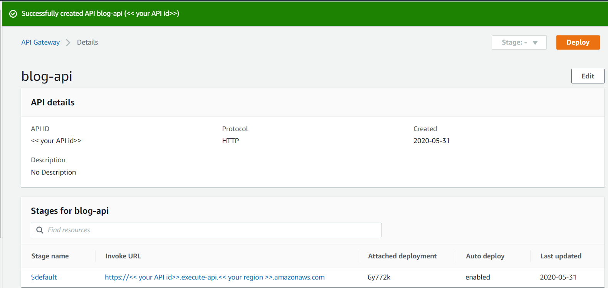

Good job, your API is now created! You can find your API url in your **stages**. It should be in the Invoke URL column.

### Let's test the beast!

I don't what you prefer to test an API, you can use a command line to curl it, or do via Postman, it's up to you :)

I will go for curl :

**GetArticles:** 
```batch
curl -v -X GET '<< your api url>>/articles'
```
*Output:*
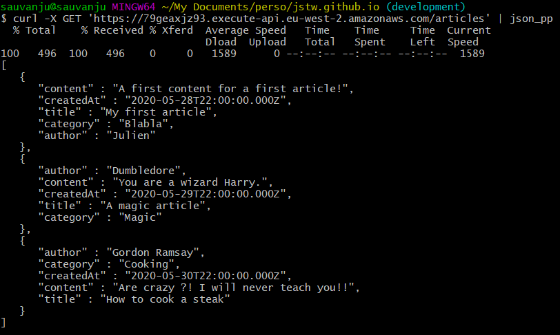

**FindArticleByTitleAndCategory:** 
```batch
curl -v -X GET '<< your api url>>/articles/My%20firs%20article/Blabla'
```
*Output:*
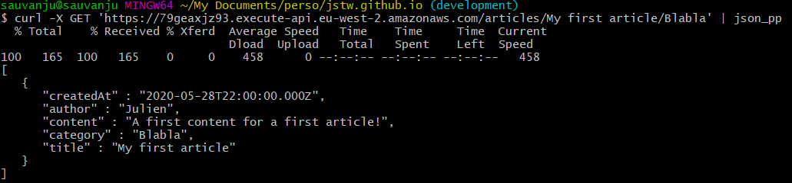


**CreateArticle:** 
```batch
curl -d '{
	"title": "My CURL Article",
	"category": "Test",
	"content": "An article created via CURL command, awesome!",
	"author": "Julien"}' -H "Content-Type: application/json" -X POST << your api url >>/articles | json_pp
```
*Output:*
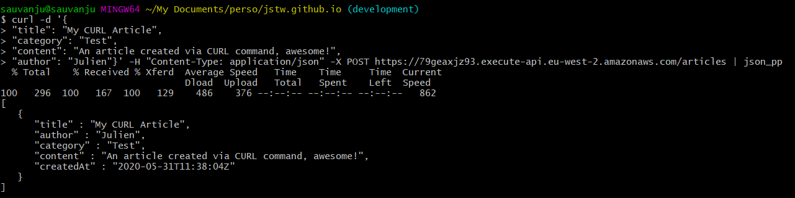


**UpdateArticle:** 
```batch
curl -d '{
	"content": "Oh, this is a curl update ?",
	"author": "CURLUser"}' -H "Content-Type: application/json" -X PUT << your api url >>/articles/My%20CURL%20Article/Test | json_pp
```
*Output:*
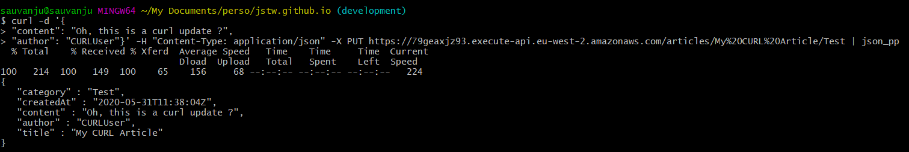

**DeleteArticle:** 
```batch
curl -X DELETE '<< your api url>>/articles/My%20CURL%20Article/Test'
```
*Output:*
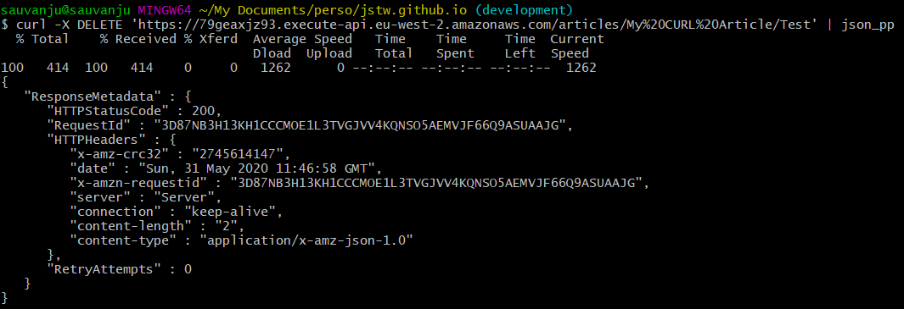

---

This is the end :) You successfully have a functional API which serves Lambda functions to intereact with your DB.

If you want to go further, you can clone a sample project that I did, to show you how we can have a fully serverless web application.

```batch
git clone git@github.com:JStw/blog-app.git
```
or you can git clone via HTTPS:
```batch
git clone https://github.com/JStw/blog-app.git
```

When its done, run a `npm install`.

Open the `App.js`, and put your Api Gateway base url in this line :

```javascript
export const API_BASE_URL = 'put your api base url here (do not put the /)';
```
Before starting the app, you should enable CORS by adding the `http://localhost:3000` Origin. If you don't do that, it will be impossile for your app to query your API.

Navigate to the API Gateway Services, and click on the `CORS` option in the left menu. Edit the configuration, and add http://localhost:3000 to the **Access-Control-Allow-Origin** list :
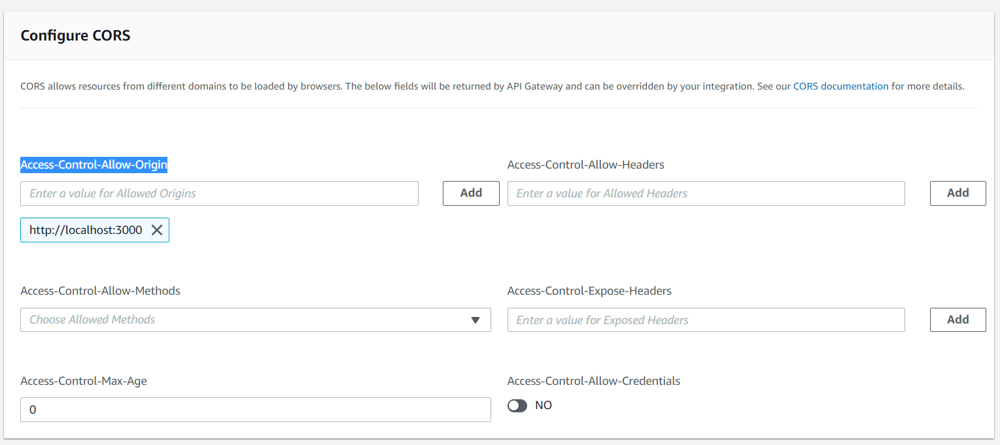

Once is done, save and go back to the React App project.

Run `npm start` and when the app will run, it will open a new tab with this following URL: `http://localhost:3000`.
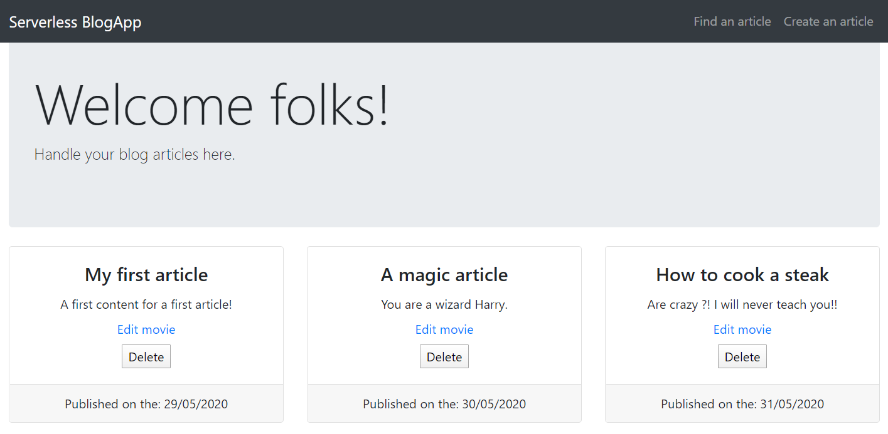

> If the port has changed because you have already something running on the 3000 port, please edit your CORS configuration by setting the correct port in your API Gateway.

I hope this article was clear for you and your API on your side working greats, this is my article guys, so if you want to send me a feedback do not hesitate to contact me via DM in Twitter :)

### Go further
Now your API is working, this is some extra-work you can do :
- Secure some API calls with Cognito.
- Send SMS / Email to your subscribers list
- Customize domain name for your API