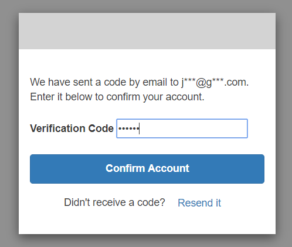
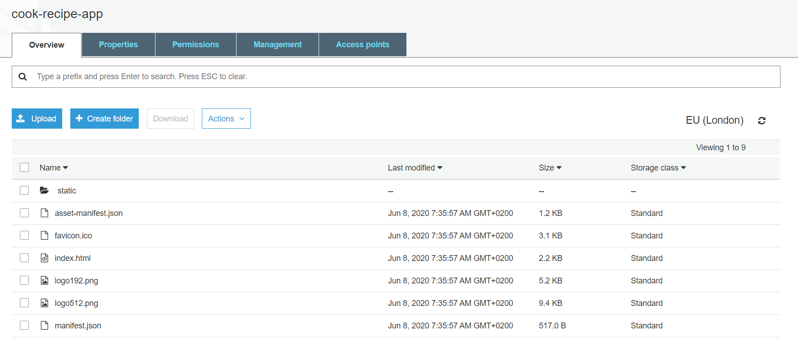
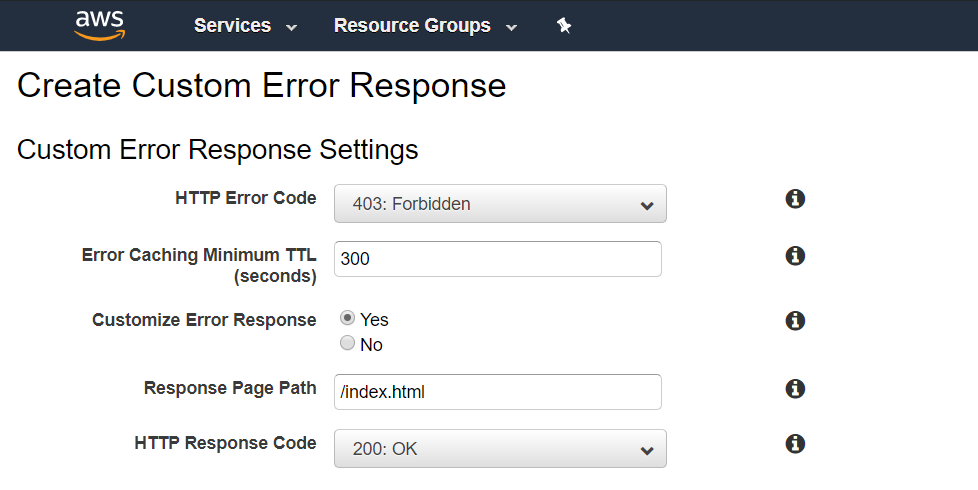

Hello guys!

Today, we will learn together how we can secure exchanges between a client application hosted in a Cloudfront distribution and an API Gateway in AWS.

I wrote [an article](../serverless-api-with-lambda-part-1) last week to explain how we can build a serverless app with a simple ReactJS client which query an API Gateway (deserved by Lambda functions) to get items from a DynamoDB.

Well, you will see this article is not very different from the previous one in the beginning, but this time we will go a little bit further in the configuration of our API Gateway. We will also have a look to some new services like Amazon Cognito, and Cloudfront.

There is a list a pre-requisites that you must have before continuing:

- An AWS account is required ([click here](https://portal.aws.amazon.com/billing/signup#/start) to create one)
- Node Package Manager ([npm](https://www.npmjs.com/get-npm)) or other package managers like [yarn](https://classic.yarnpkg.com/en/docs/install/#windows-stable).

We are now ready! Have a nice read :)

---

In general, when you want to develop an interactive client/server web application, you have to identify uniquely any users that will interact with your application.

You want probably also make a distinction between simple users and admin users, so you will add some user roles in your application.

Anyway, you will have to implement an authentication mechanism. There is so many authentication system already existing, from the simplest to the most complex one.

Today I will show you an AWS Service called Amazon Cognito, which use an authorization framework, OAuth, commonly used as a way for Internet users to grant websites or applications access to their information.

This is a quick overview of how works oAuth2 :


And this is how Amazon Cognito works :


OAuth 2.0 supports several different grants. Grants are ways of retrieving an Access Token. Deciding which one is suited for your case depends mostly on your Client's type, but other parameters weigh in as well, like the level of trust for the Client, or the experience you want your users to have.

This is the different OAuth flows that actually exists :
- **Resource Owner**: the entity that can grant access to a protected resource. Typically this is the end-user.
- **Client**: an application requesting access to a protected resource on behalf of the Resource Owner.
- **Resource Server**: the server hosting the protected resources. This is the API you want to access.
- **Authorization Server**: the server that authenticates the Resource Owner and issues Access Tokens after getting proper authorization.
- **User Agent**: the agent used by the Resource Owner to interact with the Client, for example a browser or a native application.

> Have a look on this [article](https://auth0.com/docs/api-auth/which-oauth-flow-to-use) which can help you to determine which oAuth2 flows is more appropriate to your application.

I think we can now focus on the implementation of our application. Let me present you the architecture:


Let's summarize this schema regarding the Client Side operations:

1) Customers will sign-in through the Amazon Cognito with their credentials. They can also create an account with email registration confirmation.
2) Once logged, Amazon Cognito will redirect to our application with an Authorization Code.
3) We will exchange this Authorization Code with an Access Token.
4) Once the Access Token available we will be able to query our API.

This token will be essential for the rest, because we will protect all our API routes by attaching an "Authorizer" that will check all requests sent to our API, if they contain a valid access token provided by Cognito.

Time to code! Let's connect to the AWS Console and let's move on :)

###First step: Creation of our Database

We will create a simple DynamoDB which will contains our secret cook recipe list.

Let's navigate to DynamoDB via `Services > Database > DynamoDB`.

Once you are here, hit the **Create Table** and let's provide a table name, **recipes** for example, and fill our **Primary Key** by adding :
- A "name" (String) property as Partition Key.
- A "category" (String) property as Sort Key.

Next, we need to add an index to our table. You can configure one like below :


Then, for the provisioned capacity part, I will put the minimal values for this demo, but you can provides any resources what you will need, depends on your demand.


Finally, we can now create our table! It will take few seconds to be available.

Once it is, you can click on the `Items` tab, and provide some basic items. I provide you a sample list of them :

```json
{
  "name": "Pizza",
  "category": "Fast Food",
  "calories": 895,
  "aliments": "Chorizo, vegetables, tomatoes and cheese, a lot of cheese!",
  "duration": 15
},
{
  "name": "Salad",
  "category": "Bio",
  "calories": 410,
  "aliments": "Salad, cucumber, tomatoes and tuna.",
  "duration": 15
}
```

Our DynamoDB is now ready. Let's move on to the creation of our Lambda.

###Second step: Lambda Function
Our Lambda Function will query our Database to retrieve all recipes. To create our Lambda, navigate to `Services > Compute > Lambda`.

Once its done, create on **Create Function**.

Leave the first selected option as is (Author From Scratch), and give our lambda a name: **GetRecipes** and select **Python 3.8** for the language Runtime.

Our Lambda will need some permissions to interact with DynamoDB. For that, click on the **Create a new role from AWS policy templates**, search for **Simple microservice permissions** in the Policy templates selector and then provide a role name: **myDynamoDbRole** like below :


Once it's done, create your function and provide this following code :

```python
# Boto is the Amazon Web Services (AWS) SDK for Python
import boto3

# To interact with DynamoDB, I just need to specity what resource I will use from boto3 (here: dynamodb)
dynamodb = boto3.resource('dynamodb')

# Now I specify which table in DynamoDB I want to interact with.
table = dynamodb.Table('recipes')
    
def lambda_handler(event, context):
    try:
        # Here, I will use a scan operation, to retrieve ALL my table items.
        response = table.scan()
        
        # Finally, I just return all the Items I found.
        return response['Items']
    except Exception as e:
        # If an exception was thrown, I just catch it to print a log, and then I raise the error.
        print('An error occured while retrieving Recipes table.')
        raise e
```

Save your function, and we will provide a test event to test our lambda Function. Click on the `Test` button, and leave the default configuration as is. Just provide a name to your test event, and hit `Create`.

Once your test event has been created, you can click again the the **Test** button and you should have an output like this :


Our Lambda configuration is over, now let's have a look on our API Gatewa.

### Third step: Create  the API

Let's navigate through `Services > Networking & Content Delivery > API Gateway`.

Let's first create our **cook-recipes-api** (HTTP API) and integrate the lambda function like below :


and then configure the route to get the recipes like this :


Now you can hit **Next**, **Next** again and **Create**, and your API will be created few seconds after. Congrats! Our API is now created :


As you wan see, your API has an **Invoker URL**. This is the base URL of your API. So, to test our API, open your browser with this following URL: `https://<< your api gateway invoker url >>/recipes`

You should see all your items in your DynamoDB like below :


Well, we did a great job. Our API now works successfully!

*But, why did you said its secure ?! Everyone can access to my cook recipe list with this endpoint...*

That's true! Now, we will handle the security part with Amazon Cognito.

### Fourth step: Configure Amazon Cognito

Amazon Cognito is not present in the Services dropdown, but you can search it directly by tapping **Cognito** :


Once you are, we will firstly handle our User Pool. Click on **Manage User Pools**.

Provide a name to your user pool, **CookRecipePool** for example, click on **Review defaults**, and **Next**.

> There is lot of configuration possible for User Pools, you can manage the required attributes for the Log-in part, define the "username" attributes, manage password policies, activate MFA etc.

On the Review's page, we will add a Client Application by clicking on **Add app clients...** Click again on **Add app client**, provide a name to your App Client, **CookRecipeApp** for example, leave the default configuration as is and hit **Create App Client**.

Once it's done, click on **Return to pool details** and create the user pool.

Our user pool is now created, we will configure our **App Client Settings** like below :


In this settings you just need to :
- Check the **Cognito User Pool**
- Provide the **Sign-in/Sign-out URLs** (we don't have our Cloudfront distribution ready for now, so you can put a temporary URL)
- Allow the **Authorization Code Grant** OAuth Flow.
- Allow at minimum 1 scope (email for example).

We will update the Sign-in/Sign-out later. Now we can claim a Domain Name for our User Pool. Click on **Domain Name** and choose a domain which is available like below :


You can now create your domain, and the next step is to test our User Pool.

To access to the Log-in page, we should pick up the **App Client ID** first. Go to the **App Clients** menu on the left bar, and you should be able to see your App Client name with the App Client ID like below :


Ok so, to the URL to provide to Log-in through Amazon Cognito will be :

`https://<< your domain name >>.auth.<< your AWS region >>.amazoncognito.com/login?response_type=code&client_id=<< your app client ID>>&redirect_uri=<< your redirect URI>>`

Please replace the :
- Domain name (your domain previously created)
- Client id (provide your app client ID)
- Redirect uri (should be https://www.google.com/authenticate)

For me it will looks like :

**https://cook-recipes-app.auth.eu-west-2.amazoncognito.com/login?response_type=code&client_id=13ft34s2dt7nn0ef0k4p512hgp&redirect_uri=https://www.google.com/authenticate**

You should be able to see your Log-in page :


Now we will sign up to obtain an account. Let's provide an username, a valid email address and a password.

You should receive a verification code in your mail inbox :


Copy/paste this code and create your account :



Once is done, you will be redirected to the **Callback URL** you provided when we configured our App Client Settings. Normally, you have been redirected to the 404 google page, but the most interessant part is the URL :


As you can see, we get an **Authorization Code**.

This code can be exchanged with an access token. But to get an access token, we need to implement a new API Gateway route to query our Cognito User Pool.

Before creating our route, we will create a new Lambda Function that will handle this token exchange. Let's navigate to `Services > Compute > Lambda` again.

Once you are here, do the same thing we did for the creation of our GetRecipes lambda :
- Create lambda function
- Leave "Author from scratch" default option selected
- Provide a name (CognitoTokenExchange)
- For the execution role, leave the first option selected (Create a new role with basic Lambda permissions)

Once your lambda is created, I provided you a ZIP file which contains our Lambda Function but also the dependencies needed to make an HTTP requests. [Click here](./cook-recipe-authenticate.zip) to download the zip file.

Then, click on the **Edit code inline** like below :


And upload the ZIP file previously downloaded and save your lambda.

Now you should update a little bit the lambda by replacing this portion of lambda :
```python
import json
import requests
import urllib3

token_url = "https://<< your domain name >>.auth.<< your AWS region >>.amazoncognito.com/oauth2/token"
callback_uri = "https://www.google.com/authenticate"
client_id = '<< your app client id >>'
client_secret = '<< your app client secret >>'

def lambda_handler(event, context):
    authorization_code = event['pathParameters']['code']
    data = {'grant_type': 'authorization_code', 'code': authorization_code, 'redirect_uri': callback_uri}
    access_token_response = requests.post(token_url, data=data, verify=True, allow_redirects=False, auth=(client_id, client_secret))
    
    return json.loads(access_token_response.text)

```

with your **Domain Name** (like we did above), your **App Client ID** and your **App Client Secret**. You can find this following information in the Amazon Cognito service, in the `General settings > App clients` menu in your **CookRecipePool** :


Once you have updated the Lambda function, you can save it. So now we will test our Lambda Function. Go back to your Log-in URL :

`https://<< your domain name >>.auth.<< your AWS region >>.amazoncognito.com/login?response_type=code&client_id=<< your app client ID>>&redirect_uri=<< your redirect URI>>`

Now you have 2 possibilities:
- Sign in as **your username**
- Re-login with the credentials you provided during the subscription.


Please log-in with your credentials, and pick up the **authorization code** from the redirected URL :


For example, my authorization code is: `53c7105e-09b3-4a93-9062-0cdc74d30bd2` (yours will be different).

Go back in your Lambda Function and add a **Test Event**. Click on Test button, and add this following JSON:
```json
{
  "pathParameters": {"code": "<< put your authorization code here"}
}
```
like below :


Save your Test Event, and hit the Test button again. Congrats! You should have a response with all your tokens :


The next step is to configure our route to invoke our lambda. Let's navigate to `Services > Networking & Content Delivery > API Gateway`.

Select our API, **cook-recipes-api**, and add a new route :


Once your route is created and attach our lambda function by clicking **Attach integration** :


Click on **Create and Attach integration** and find your Lambda function (RecipeCookAuthenticate) to attach to your route :


We will test now if our API Gateway integration works. Open a new browser tab with your Cognito log-in page :

`https://<< your domain name >>.auth.<< your AWS region >>.amazoncognito.com/login?response_type=code&client_id=<< your app client ID>>&redirect_uri=<< your redirect URI>>`

And sign-in one more time. Pick-up the code, but now open a new browser tab with your API Gateway URL.

The URL should looks like:
`<< your api gateway base url >>/token/<< your authorization code >>`

Finally, our API endpoint to retrieve our access token works successfully:


The next step will be to configure our Client Side App.

### Fifth step: Configure the ReactJS app with S3/Cloudfront

I just created a sample ReactJS application which is available in my [Github](https://github.com/JStw). To get the app, you can git clone my project :

```batch
git clone git@github.com:JStw/recipe-app.git

or

git clone https://github.com/JStw/recipe-app.git
```

One the application has been cloned, go to the **recipe-app** folder and run a `npm install`. When your **node_modules** will be installed, you can open the `App.js` file and edit this following lines :

```javascript
export const API_BASE_URL = '<< put your api base url here >>';
export const COGNITO_BASE_URL = '<< put the cognito base url here >>';
export const APP_REDIRECT_URI = '<< put your cloudfront url here >>/authenticate';
export const APP_CLIENT_ID = '<< put your amazon app client id here >>';
```

- **API_BASE_URL** is your API Gateway Invoke URL.
- **COGNITO_BASE_URL** is your Amazon Cognito domain name (available in your User Pool > Domain Name)
- **APP_REDIRECT_URI** is the URL we configured in our User Pool (The Callback URL)
- **APP_CLIENT_ID** is the identifier also present in your User Pool > App Client Settings.

For example, for me the updates will be :
```javascript
export const API_BASE_URL = '	https://eq0umxfk86.execute-api.eu-west-2.amazonaws.com';
export const COGNITO_BASE_URL = 'https://cook-recipes-app.auth.eu-west-2.amazoncognito.com';
export const APP_REDIRECT_URI = 'https://www.google.com/authenticate';
export const APP_CLIENT_ID = '13ft34s2dt7nn0ef0k4p512hgp';
```

Once these 4 variables has been updated, save the `App.js` file and run a `npm build`. When this command has finished, you should see a `build` folder.

Now we will create a S3 bucket to host our application. Let's navigate to `Services > Storage > S3`.

Once you are here, create a bucket (bucket name should be unique across the world), so for me I'll choose `cook-recipe-app` but you can provide another name.

Leave the default configuration as is, and hit the `Create` button. Then, you have to upload all our `build` folder content in your S3 bucket. Do not forget to upload also the `static` folder with the **js** and **css** folder.

Your bucket should look like below :




Once your files has been added, we will configure S3 to host a Web Application. For that, go to the root folder of your S3 Bucket, click on the **Properties** tab and then **Static website hosting**.

- Click on **Use this bucket to host a website**.
- Specify **index.html** for the Index document.
- Specify also **index.html** for the error document.

and then hit **Save**.

Before accessing our S3 URL, we have to grant a public read access for everyone. For that, click on your bucket **Permissions**, and then select the first tab, **Block public access**.

Turn off the **Block public access** (the first option checked) and all the other option will uncheck.

Once is done, hit **Save** and confirm the action by tapping **confirm**.


Finally, we have to add a **Bucket Policy** to make our bucket content publicly available.

Click on **Bucket Policy** and add this JSON policy :

```json
{
    "Version": "2012-10-17",
    "Statement": [
        {
            "Sid": "PublicReadGetObject",
            "Effect": "Allow",
            "Principal": "*",
            "Action": [
                "s3:GetObject"
            ],
            "Resource": [
                "arn:aws:s3:::<< put your bucket name here >>/*"
            ]
        }
    ]
}
```

like below :


You static website is now configured, so we can test our S3 bucket URL. Your URL should be like :

`https://<< your bucket name >>.s3.<< your region >>.amazonaws.com`

For example, for me it will be:

`https://cook-recipe-app.s3.eu-west-2.amazonaws.com/index.html`

Ok let's test :


Congrats! Our S3 application works ;-) According to the S3 documentation :

> Your website is available at the Amazon S3 website endpoint. However, you might have a domain, such as example.com, that you want to use to serve the content from the website you created. You might also want to use Amazon S3 root domain support to serve requests for both http://www.example.com and http://example.com. This requires additional steps. For an example, see Configuring a static website using a custom domain registered with Route 53.

For more information you can [read the official documentation](https://docs.aws.amazon.com/AmazonS3/latest/dev/HostingWebsiteOnS3Setup.html).

If you click on the **Serverless API** header menu, you will be redirected to the Home page, and you should see a link **Please log-in to see recipes list**.

If you click on this link, you normally will be redirected to the Amazon Cognito Log-in page.

Let's tackle the final step, the creation of our Cloudfront distribution.

### Final step: Create the Cloudfront distribution

We are close to the end guys! Let's navigate to `Services > Networking & Content Delivery > Cloudfront`.

First step is to **Create Distribution**. We will choose the first option (Web delivery method).

Now, we have to configure our Cloudfront distribution. We will just update few of them :

- Origin Settings :
    - Origin Domain Name should be your Amazon S3 Bucket previously created.
    - Leave the rest as is.
- Default Cache Behavior Settings :
    - Redirect HTTP to HTTPS
    - Allowed methods: GET, HEAD, OPTIONS

For all the other configuration, leave as is. Just update the **Default Root Object** by putting **index.html**, and finally you can create your distribution.

Once is done, it will take some time to create and deploy your distribution. Meanwhile, click on your distribution in the list, and ***Distribution Settings**.

Go to the **Errors Pages** tab and we will create some custom error response :



Let's create this custom error, and go back to your Cloudfront distributions list. It should be still in progress, but it's ok because we have few more configuration to do.

As you can see, we have a cloudfront domain name available :


For example for me it's: `d39y0kvui8eeum.cloudfront.net`.

If you remember we put some "fake URL" in our RecipeUserPool in Amazon Cognito. So now, we will update our Cognito settings with our Cloudfront Domain Name.

Click on the `Services` dropdown, and search **Cognito**. Once is done, go to your **App Clients Settings**.

Finally update both Sign-in and Sign-out links like below :


*(Do not forget to provide your Cloudfront distribution name, and not mine)*.

Save your changes, and now go to `Services > Networking & Content Delivery > API Gateway`.

Find your API and open the **CORS** menu in the left tab. Configure CORS like below :


You just need to allow your Cloudfront Domain Name in your API Origins, but also the **Authorization** header.

Once it's done, save your changes. 

If you remember, we wanted to protect our API /recipes endpoint. Actually, every one can access it.

Stay on the API Gateway service, but this time open the **Authorization** menu.

Find your GET `/recipes` endpoint, and click on **Create and Attach Authorizer**.

Configure your **Authorizer** like below :


Be careful, your **Issuer URL** will be different. If you remember one of the first cognito schema, we need to integrate our user pool with an identity pool.

For that, we will use the Cognito IDP URL. Your Issuer URL should be like :
`https://cognito-idp.<region>.amazonaws.com/<YOUR_USER_POOL_ID>`

You can find your **user pool id** in the Cognito service, in the general settings :


The last Authorizer settings, is the **Audience one**. You just need to provide your **App Client ID**. Once it's done, hit **Create and Attach**.


As you can see, your `/recipes` endpoint is now protected with a JWT Authorizer. It means that if we re-open a browser tab, and try to get our cook recipe list one more time :


This time we should be identified to access our recipe list.

Ok so now I think our Cloudfront distribution should be available, so go back to your distribution list.

Copy/paste your Cloudfront Domain Name and open it in your browser :


If you try to click on the **List Recipes** nav bar link, you should have a message: "You are not supposed to be here".

Ok so, let's sign-in by clicking **Please log-in to see recipes list**.

Hey! Why we are this error ?!


If you remember in our ReactJS application, we updated this variables :

```javascript
export const API_BASE_URL = 'https://eq0umxfk86.execute-api.eu-west-2.amazonaws.com';
export const COGNITO_BASE_URL = 'https://cook-recipes-app.auth.eu-west-2.amazoncognito.com';
export const APP_REDIRECT_URI = 'https://www.google.com/authenticate';
export const APP_CLIENT_ID = '13ft34s2dt7nn0ef0k4p512hgp';
```

Problem is our **APP_REDIRECT_URI** has change, because we put the Cloudfront URL.

So we have to update the **APP_REDIRECT_URI** by putting our Cloudfront URL like below :
```javascript
export const APP_REDIRECT_URI = 'https://d3lzprsa47l9ig.cloudfront.net/authenticate';
```

Yes, we need to rebuild once more time ^.^

Run a `npm build`. And re-upload your `build` folder content to our S3 bucket. I suggest to delete the entire content, and re-upload all the fresh content builded.

Before returning to our Cloudfront App, we updated our ClientSide App with our new Cloudfront Callback URL, but we should also update our Lambda which is exchanging our authorization code with an access token.

Open `Services > Compute > Lambda`, and open your **RecipeCookAuthenticate** lambda function.

Change this line and replace the google URL by your cloudfront URL :
```python
callback_uri = "https://d3lzprsa47l9ig.cloudfront.net/authenticate"
```

Ok so now if we go back to our Cloudfront App, let's re-try by clicking the sign-in app link and now we are able to Log-in properly :


So, enter your credentials and sign-in.

As you can see this time, we do not have been redirected to the Google fake page to get our authorization code, it has been redirected to our app :


And finally you will be redirected to the home page, authenticated :


Click on the **List Recipes** now, and you should see your data :


Good job! We are done now ;-)

Let's summarize what you achieve during this tutorial :
- You created a DynamoDB table.
- You created a Lambda function to retrieve DB items.
- You created an API with API Gateway to invoke the lambda to get the items from the database.
- You configured Amazon Cognito with the Authorization Code OAuth flow.
- You created a second lambda to exchange the authorization code with the access token.
- You added a new route to trigger this token exchange lambda.
- You deployed a ReactJS application, hosted it in AWS S3 and configuring a Bucket Policy to publicly access it.
- You created a Cloudfront application deserving the S3 bucket.
- You created and attach an Authorizer to your API Gateway route.

Well done! I think you can play a little bit with it, but you did a great job and played with many AWS services :)

I hope this tutorial was helpful for you, if you liked it do not forget to share ;)

See you next time!
